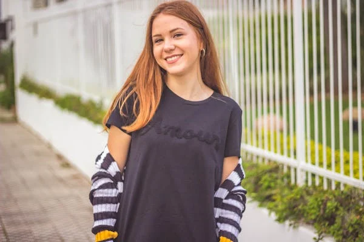
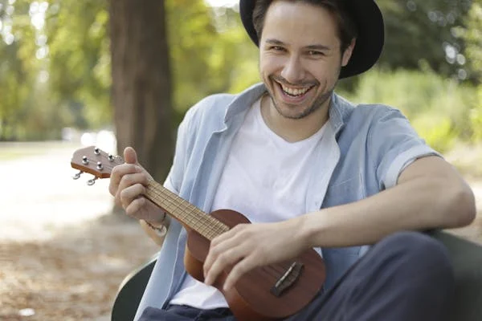
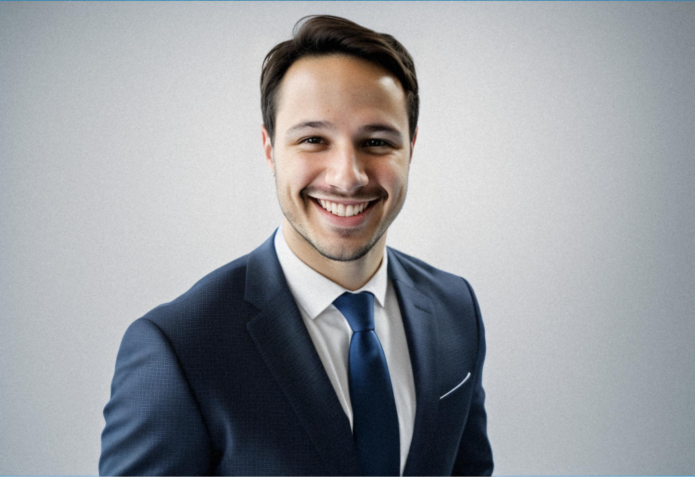

export const faqSchema = {
  "@context": "https://schema.org",
  "@type": "FAQPage",
  mainEntity: [
    {
      "@type": "Question",
      name: "Can AI headshots look consistent across a whole team?",
      acceptedAnswer: {
        "@type": "Answer",
        text: "Yes, but only if consistency is designed in. Consistency comes from fixing lighting, background, crop, and grade as a single approved treatment and running every person through it — not from everyone using the same app.",
      },
    },
    {
      "@type": "Question",
      name: "How many photos does each person need to submit?",
      acceptedAnswer: {
        "@type": "Answer",
        text: "Typically eight to sixteen varied photos per person: different angles, lighting conditions, and expressions, with the face clearly visible and unobstructed. Quality and variety matter more than quantity — sixteen near-identical selfies perform worse than eight varied ones.",
      },
    },
    {
      "@type": "Question",
      name: "What does a team headshot session cost compared to a photographer?",
      acceptedAnswer: {
        "@type": "Answer",
        text: "Traditional corporate headshot sessions are commonly quoted per person or per day plus retouching, and require scheduling everyone into one location. The AI equivalent removes the scheduling and location constraints entirely, which for distributed teams is often the larger saving.",
      },
    },
    {
      "@type": "Question",
      name: "How do you handle new hires after the initial batch?",
      acceptedAnswer: {
        "@type": "Answer",
        text: "This is the main advantage of storing the treatment rather than booking a session. A new hire runs through the same approved setup months later and matches the existing set, instead of being visibly the person photographed on a different day.",
      },
    },
    {
      "@type": "Question",
      name: "Should employees be told their headshots are AI-generated?",
      acceptedAnswer: {
        "@type": "Answer",
        text: "Yes. People are submitting photos of their own faces, and they should know what is being produced, where it will appear, how the source images are handled, and that they can opt out. Treat participation as consented rather than assumed.",
      },
    },
  ],
};

Most AI headshot coverage is written for one person who needs a better LinkedIn photo. That is a solved problem with a dozen adequate answers. The harder problem, and the one companies actually have, is a team page where forty portraits need to look like they belong to the same organisation.

**The short version:** individual quality is table stakes now. Consistency across people is the part that is difficult, and it comes from fixing the treatment once rather than from everyone using the same tool.

<!-- truncate -->

<aside className="astria-article-cta" aria-label="Start creating with Astria">
  

    
  

  
Fashion production workspace

  <h2 className="astria-article-cta__title">Create your next campaign with Astria</h2>
  
Generate fashion visuals from your products, or start with a production-ready template.

  

    <a className="astria-article-cta__button astria-article-cta__button--primary" href="/prompts">
      Generate→
    </a>
    <a className="astria-article-cta__button astria-article-cta__button--secondary" href="/gallery/workspaces">
      Templates gallery→
    </a>
  

</aside>

## Why team headshots break where individual ones don't

Put forty independently-generated headshots on one page and the failures are immediate, even to people who cannot name them:

- Light comes from the left on some faces and the right on others.
- Backgrounds are eleven different greys.
- Some portraits are cropped at the collarbone, others mid-chest.
- Colour grade drifts — warm here, neutral there.
- Depth of field varies, so some faces sit flat against the background and others float.

Each image is fine. The grid is not. And a visitor reads that grid in about two seconds, well before they read anyone's job title.

This is precisely what a photographer's day gives you almost for free: one room, one light setup, one lens, one afternoon. Consistency is a *by-product* of the constraint. Remove the constraint — everyone generating their own portraits, whenever, wherever — and consistency has to be engineered back in deliberately.

## The treatment is the deliverable

The useful mental shift is that the reusable asset is not the images. It is the specification that produced them:

- **Lighting** — key direction, softness, fill ratio, whether there is a rim
- **Background** — an exact colour or an exact environment, not "a neutral studio"
- **Crop and headroom** — where the frame cuts, consistently
- **Grade** — warmth, contrast, saturation
- **Wardrobe register** — how formal, and how tightly enforced
- **Expression and posture** — the register of the whole set

Approve that once, with whoever owns the brand. Then every person runs through it. The first portrait takes real thought; the fortieth takes none. And when someone joins in March, they run through the same specification and match the set — which is the failure mode of the photographer's day, where the new hire is visibly the person photographed against a different wall.

## What each person needs to submit

Eight to sixteen photos, and the variety matters more than the count:

- **Varied angles** — front, three-quarter both ways, slight up and down
- **Varied lighting** — indoor, outdoor, window light; not all from one room
- **Varied expressions** — neutral, slight smile, full smile
- **Face unobstructed** — no sunglasses, no hands, no heavy shadow across the face
- **Recent** — matching current hair and any glasses they actually wear

What degrades results: sixteen frames from one burst, heavy filters, group photos cropped down to one face, low resolution, and photos that are all from the same three-month period five years ago.

Send the whole team this list once. The submission quality drives everything downstream, and it is the cheapest place to intervene.

## Where these images do and don't work

Worth being straightforward, because overreach is what makes people distrust the whole category.

**Works well:** team and about pages, LinkedIn and internal directories, conference speaker bios, sales collateral, email signatures, press kits where a consistent set is expected.

**Works with care:** anything a journalist may republish as documentary. Some publications have policies about synthetic imagery. Ask before supplying.

**Doesn't work:** identity documents, anything requiring a verified likeness, and any context where the image asserts that a specific moment happened. That last one is not a technical limit — it is a straightforward honesty limit.

## Handle consent properly

People are giving you photographs of their faces. That deserves more care than a calendar invite:

- Tell them what is being produced and where it will be published.
- Say how the source photos are stored and when they are deleted.
- Give a real opt-out that does not require an explanation, with a fallback that does not look like a punishment on the grid.
- Let each person approve their own final portrait. A likeness someone dislikes is worse than no portrait at all, and this is the single most common source of complaints.

Distributed teams get the biggest practical win here — a photographer's day requires everyone in one city on one date, which for a remote company is either impossible or an expensive offsite. But the consent conversation gets *more* important when there is no shoot day, because there is no moment where someone can simply decline to stand in front of the camera.

## A sensible sequence

1. **Decide the treatment** with whoever owns the brand — lighting, background, crop, grade, wardrobe register. Approve it on two or three people first.
2. **Send one submission brief** to everyone, with the photo guidance above and the consent details.
3. **Run a pilot of five**, deliberately varied — different skin tones, hair, glasses, ages. Fix the treatment against the hardest cases, not the easiest.
4. **Run the team**, then let each person approve their own.
5. **Keep the treatment** for new hires. This is the part that pays back, and the part most companies forget to ask about.

The same logic — approve a treatment once, run many subjects through it, keep it for later — is what the [AI fashion photoshoot guide](./ai-fashion-photoshoot-guide.md) applies to products instead of people. It is the same idea with a different variable.

## Frequently asked questions

### Can AI headshots look consistent across a whole team?

Yes, but only if consistency is designed in. Consistency comes from fixing lighting, background, crop, and grade as a single approved treatment and running every person through it — not from everyone using the same app.

### How many photos does each person need to submit?

Typically eight to sixteen varied photos per person: different angles, lighting conditions, and expressions, with the face clearly visible and unobstructed. Quality and variety matter more than quantity — sixteen near-identical selfies perform worse than eight varied ones.

### What does a team headshot session cost compared to a photographer?

Traditional corporate headshot sessions are commonly quoted per person or per day plus retouching, and require scheduling everyone into one location. The AI equivalent removes the scheduling and location constraints entirely, which for distributed teams is often the larger saving.

### How do you handle new hires after the initial batch?

This is the main advantage of storing the treatment rather than booking a session. A new hire runs through the same approved setup months later and matches the existing set, instead of being visibly the person photographed on a different day.

### Should employees be told their headshots are AI-generated?

Yes. People are submitting photos of their own faces, and they should know what is being produced, where it will appear, how the source images are handled, and that they can opt out. Treat participation as consented rather than assumed.

[Explore Astria](https://www.astria.ai/).
