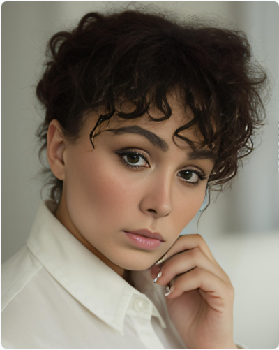
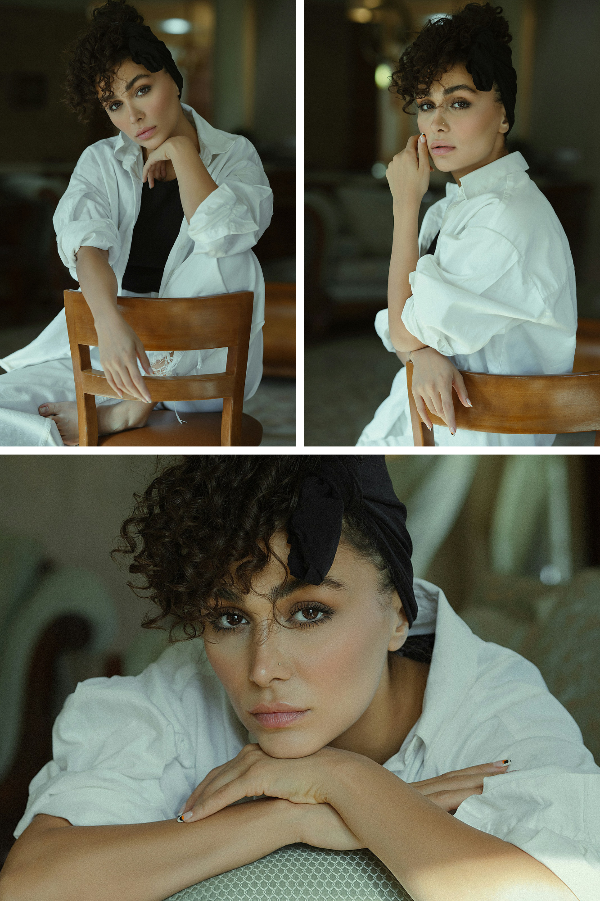
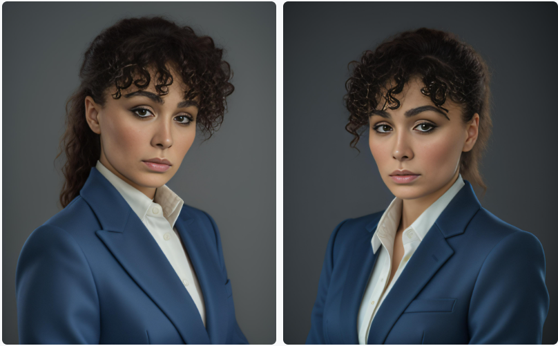
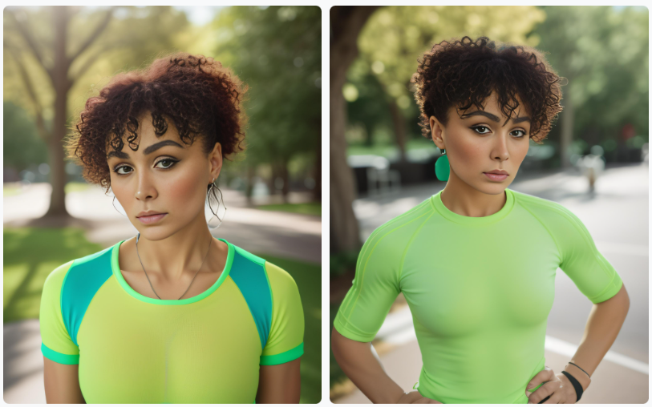
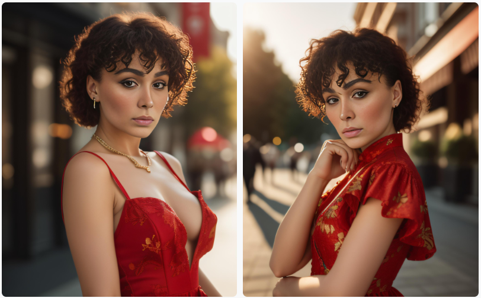
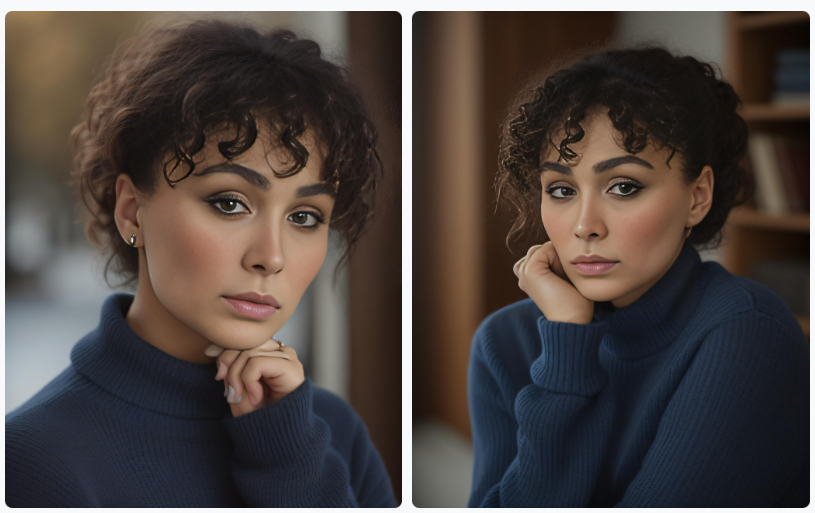

*Originally published April 2024. Reviewed August 2026 — see [Where this stands in 2026](#where-this-stands-in-2026) below.*

You can now generate instant custom headshot photos for professional use in just a few clicks.

Several industries could benefit from it. Here are some key ones:

**1. Online Platforms & Gig Economy:**


* Freelancers and independent contractors on platforms like Upwork or Fiverr need professional headshots for their profiles to appear credible and attract clients.
* People signing up for ride-sharing services like Uber or Lyft often require profile pictures that meet platform guidelines.

**2. Remote Work & Video Conferencing:**


* With the rise of remote work, employees need professional headshots for video conferencing platforms like Zoom or Google Meet.
* Many companies request profile pictures for internal directories.

**3. Events & Conferences:**


* Attendees at conferences or trade shows might need quick headshots for badges or presentations.
* Event organizers may require speaker headshots for promotional materials.

**4. Retail & Hospitality:**


* Retailers or restaurants can use headshot generators for employee name tags or online staff directories.

**5. Education & Training:**


* Online courses or educational platforms can benefit from student profile pictures.
* Professional development programs often require headshots for certificates or online profiles.

**6. Media & Marketing:**


* Content creators or bloggers frequently need quick headshots for social media profiles or website bios.
* Marketing agencies can use headshot generators for clients who need profile pictures on short notice.

So how do we at Astria.ai come in?


<!-- truncate -->

# Create AI Headshots and Portraits From a Reference Photo

Astria's composer can preserve a person's likeness from a reference photo without training a custom model. You can start with one clear photograph and generate a new portrait directly from the composer.





This feature comes in very handy if you need to generate images quickly and efficiently – such as if you’re offering a free-tier service in a user app and need profile images to be generated in a jiffy. It can also be applied in real-time applications like live-streaming or virtual try-ons.

In e-commerce applications, reference-based generation can let users visualize products with their own images. It can also support personalized avatars, profile photos, social content, and other experiences where the result should resemble the person in the supplied photo.

Use a sharp, well-lit reference with one unobstructed face. A front-facing or three-quarter portrait is easier to preserve than a distant group photo, heavy filter, or image where hair, glasses, or hands cover important facial details.


# AI Portraits Without Model Training vs Full Fine-Tuning

Astria offers full fine-tuning tools using the [Dreambooth](https://huggingface.co/docs/diffusers/en/training/dreambooth) API. This is a technique that updates the entire Stable Diffusion model by training on just a few images of a subject or style. This is a pretty efficient way of fine-tuning as it allows for the generation of realistic and diverse images of the specific subjects or concepts.

Apart from this, Astria also has the option of LoRA fine-tuning. In this technique, instead of fine-tuning the entire model, a low-rank adapter layer is inserted into the model architecture. This reduces the computational time and storage requirements leading to a lower cost of fine-tuning.

Both techniques above are well suited to high-fidelity identity preservation, but they require a training step. Reference-based generation is the faster option when you want to begin from an attached photo.

Reference-based generation does not update the model's weights. The attached image conditions the generation at inference time, which is why there is no separate model-training wait.


# How to Create No-Training AI Portraits in the Composer

You can begin with one photo. For the examples below, we used three photos of a model from [Unsplash](https://unsplash.com) so the face is visible from more than one angle.





1. Open the [Astria composer](https://www.astria.ai/prompts).
2. Drag a clear face photo into the composer to attach it as a reference. Add another angle only when it helps clarify the likeness.
3. Describe the portrait you want: framing, wardrobe, expression, lighting, background, and photographic style.
4. Generate, review the likeness, and adjust the reference or prompt if an important facial feature drifts.

The reference remains attached in the composer, so the prompt only needs to describe the new portrait. Here are four starting points.


## Use-Case 1: Professional Networking

```
Prompt: A professional headshot of a female software engineer, wearing a blue blazer, with a friendly smile and confident gaze, studio lighting, high-resolution, 8k, sharp focus, Nikon D850, 85mm lens, f/1.8, 1/200s, ISO 100

Negative Prompt: unprofessional, casual, blurry, low-resolution, poor lighting, unflattering angles, awkward pose, unfriendly expression, distracting background, snapshot, amateur, overexposed, underexposed, harsh shadows, uneven skin tone
```




## Use-Case 2: Fitness & Wellness Coach

```
Prompt: A vibrant and inspiring headshot of a fitness coach, wearing a bright green athletic top, with an energetic smile and motivated expression, outdoor natural lighting, high-resolution, 8k, sharp focus, Nikon Z7 II, 85mm lens, f/2.8, 1/200s, ISO 200, vivid color palette, blurred park background, sun flare

Negative: unhealthy, unmotivated, low-energy, poorly lit, low-quality, blurry, awkward pose, unflattering angles, harsh shadows, distracting background, snapshot, amateur, overexposed, underexposed, uneven skin tone, no retouching, no visible workout equipment
```




## Use-Case 3: Social Media and Marketing Influencer

```
Prompt: A vibrant and engaging headshot of a female fashion influencer, wearing a stylish red dress, with a charming smile and confident pose, golden hour lighting, high-resolution, 8k, sharp focus, Canon EOS R5, 50mm lens, f/1.4, 1/160s, ISO 100, cinematic color grading, bokeh background

Negative: unfashionable, poorly lit, low-quality, blurry, awkward pose, unflattering angles, dull colors, flat lighting, distracting background, snapshot, amateur, overexposed, underexposed, harsh shadows, uneven skin tone, no makeup, no retouching
```





## Use-Case 4: Educational Platform & Online Learning

```
Prompt: A friendly and approachable headshot of a female history professor, wearing a navy blue sweater, with a warm smile and inviting gaze, soft natural lighting, high-resolution, 8k, sharp focus, Sony A7R IV, 85mm lens, f/2.8, 1/125s, ISO 200, neutral color palette, clean background

Negative: intimidating, unapproachable, unprofessional, poorly lit, low-quality, blurry, awkward pose, unflattering angles, harsh shadows, distracting background, snapshot, amateur, overexposed, underexposed, uneven skin tone, no retouching
```





# When a No-Training Portrait Workflow Fits

The reference-first composer works well when you need a portrait quickly and do not want to create and manage a trained model. Common uses include:


1. Professional Networking
2. Social Media and Influencer Marketing
3. Educational Platforms
4. Fitness and Wellness Apps
5. Event Apps
6. E-commerce Apps
7. Free-Tier Services

For an app integration rather than the visual composer, use Astria's current [API documentation](https://docs.astria.ai/docs/category/api) as the source of truth for reference-image inputs.

## Where this stands in 2026

The core promise — a consistent likeness without waiting for a model to train — still holds, and the instant-reference approach has since been extended across newer model branches. Two things changed worth knowing:

- **Instant references are no longer only about faces.** The same idea now covers products, poses, backgrounds, and garments, which is what makes a whole photoshoot template reusable rather than just a person.
- **A trained model still wins on hard likenesses.** For a face that has to hold up across dozens of images at close crop, training on eight to sixteen images remains more reliable than a single reference. Dragging a reference into the composer is the fast path, not the strictly better one.

If you are producing portraits for a whole team rather than one person, the constraint is consistency across people — see [AI headshots for teams](./ai-headshots-for-teams.md). For the fashion production equivalent, see the [AI fashion photoshoot guide](./ai-fashion-photoshoot-guide.md).
