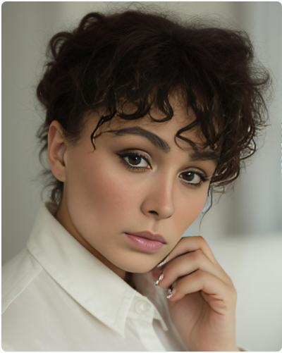
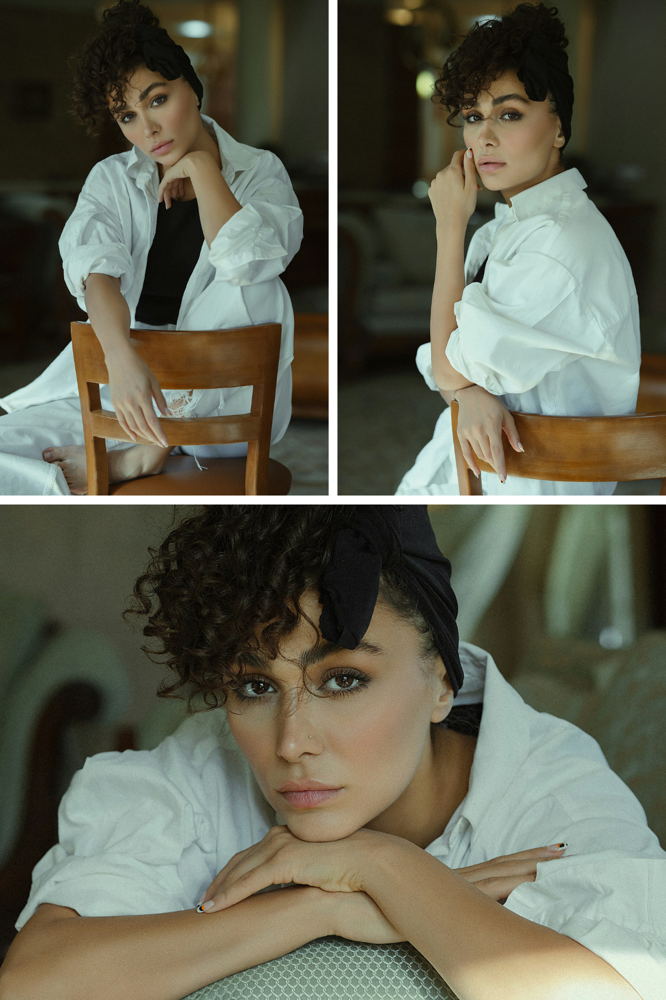
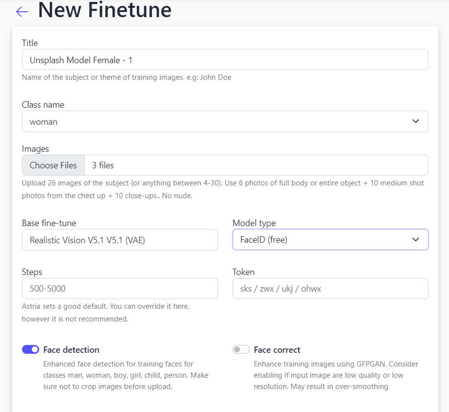
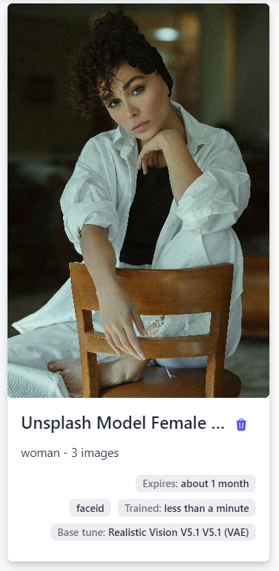
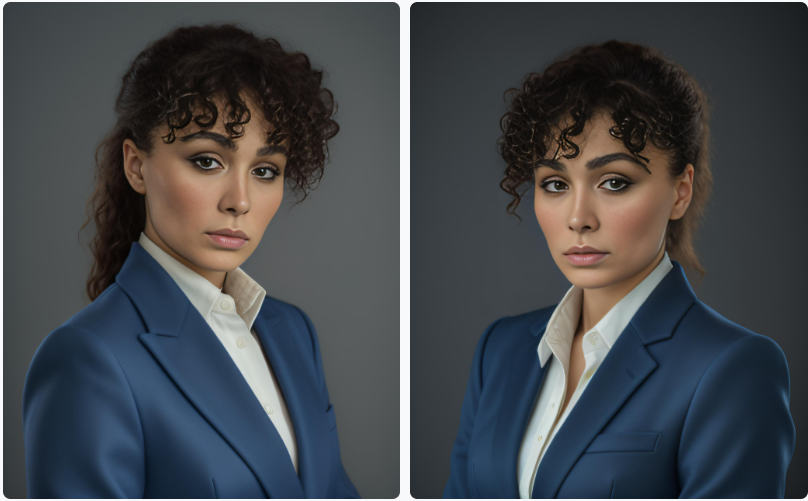
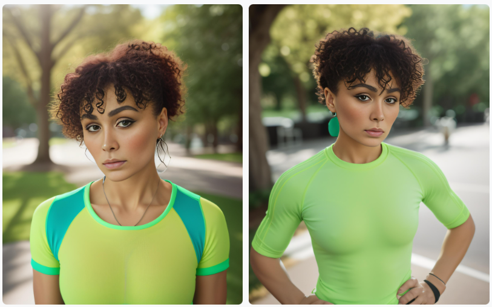
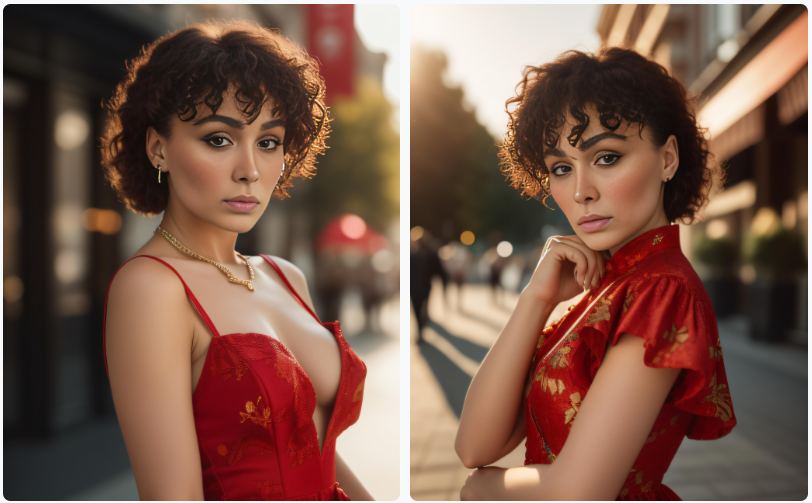
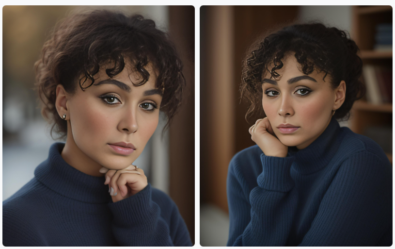

# Create Studio-Quality Custom Portraits Instantly with Astria's FaceID Tool


You can now generate instant custom headshot photos for professional use in just a few clicks.

Several industries could benefit from it. Here are some key ones:

**1. Online Platforms & Gig Economy:**


* Freelancers and independent contractors on platforms like Upwork or Fiverr need professional headshots for their profiles to appear credible and attract clients.
* People signing up for ride-sharing services like Uber or Lyft often require profile pictures that meet platform guidelines.

**2. Remote Work & Video Conferencing:**


* With the rise of remote work, employees need professional headshots for video conferencing platforms like Zoom or Google Meet.
* Many companies request profile pictures for internal directories.

**3. Events & Conferences:**


* Attendees at conferences or trade shows might need quick headshots for badges or presentations.
* Event organizers may require speaker headshots for promotional materials.

**4. Retail & Hospitality:**


* Retailers or restaurants can use headshot generators for employee name tags or online staff directories.

**5. Education & Training:**


* Online courses or educational platforms can benefit from student profile pictures.
* Professional development programs often require headshots for certificates or online profiles.

**6. Media & Marketing:**


* Content creators or bloggers frequently need quick headshots for social media profiles or website bios.
* Marketing agencies can use headshot generators for clients who need profile pictures on short notice.

So how do we at Astria.ai come in?


# Astria’s FaceID Feature for Instant Fine-tuning

With our FaceID tool, you can instantly fine-tune your images while preserving identity in a matter of seconds. All you need is just one photograph.





This feature comes in very handy if you need to generate images quickly and efficiently – such as if you’re offering a free-tier service in a user app and need profile images to be generated in a jiffy. It can also be applied in real-time applications like live-streaming or virtual try-ons.

In e-commerce applications, instant fine-tuning can be a game-changer as it allows users to visualize products with their own images seamlessly, enhancing the shopping experience and boosting conversion rates. In the gaming industry, instant fine-tuning can be used to create personalized gaming avatars or characters that resemble the user, thereby increasing immersion and emotional connection with the game. Additionally, social media platforms could use the FaceID feature to offer instant filters and lenses, letting users create and share more personalized content with their friends and followers.

Just one point to remember: the adapter was trained on human faces, so best not to try faces of your pets or other subjects at the moment. A few other points to note:


* FaceID can work with [Face Swap](https://docs.astria.ai/docs/features/face-swap) to improve similarity. Disable Face Swap in case your prompt is animation style.
* For fast generation, use [LCM schedulers](https://docs.astria.ai/docs/features/lcm).
* For realistic images, enable Face-Correct to improve the facial features.


# FaceID vs Full Fine-Tuning

Astria offers full fine-tuning tools using the [Dreambooth](https://huggingface.co/docs/diffusers/en/training/dreambooth) API. This is a technique that updates the entire Stable Diffusion model by training on just a few images of a subject or style. This is a pretty efficient way of fine-tuning as it allows for the generation of realistic and diverse images of the specific subjects or concepts.

Apart from this, Astria also has the option of LoRA fine-tuning. In this technique, instead of fine-tuning the entire model, a low-rank adapter layer is inserted into the model architecture. This reduces the computational time and storage requirements leading to a lower cost of fine-tuning.

Both the techniques above are well suited for high fidelity on identity preservation of the subject images, but they take around 5-10 minutes for process completion and, therefore, we have FaceID for instant results.

FaceID does not involve training of the model at all. Under the hood it only calculates and retains the embeddings of the training images, and then reproduces these embeddings during inference. This way the Stable Diffusion model doesn’t have to go through any changes in its weights, and that’s why the fine-tuning process is so rapid. It takes less than 10 seconds for a FaceID based fine-tune to be created.


# Guide to Using FaceID on Astria.ai

As mentioned before, the FaceID fine-tune can be done with just one image. But, for the sake of fidelity, we’ve taken 3 images of a model from [Unsplash](https://unsplash.com). Here are the input images:





Now head over to the [New Finetune](https://www.astria.ai/tunes/new) section.





Under the Advanced features, select the Model type as FaceID. Remember to provide the Class name (woman, in this case).

Your tune will be ready in a matter of seconds.

Here’s the API to create the tune:


```bash
curl -X POST -H "Authorization: Bearer $API_KEY" https://api.astria.ai/tunes \
         -F tune[title]="Unsplash Model Female - 1" \
         -F tune[name]=woman \
         -F tune[base_tune_id]=690204 \
         -F tune[images][0]="@1.jpg" \
         -F tune[images][1]="@2.jpg" \
         -F tune[images][2]="@3.jpg" \
```


Base_tune_id = 69024 refers to the Realistic Vision V5.1 (VAE) model that we used as the base model. You can check out the list of available models [here](https://www.astria.ai/gallery/tunes).





Let’s start prompting with some real-life use cases, where instant headshot generation would be useful.


## Use-Case 1: Professional Networking

```
Prompt: A professional headshot of a female software engineer, wearing a blue blazer, with a friendly smile and confident gaze, studio lighting, high-resolution, 8k, sharp focus, Nikon D850, 85mm lens, f/1.8, 1/200s, ISO 100 &lt;faceid:1155049:1.0> **(replace this with the faceid number of your tune**)

Negative Prompt: unprofessional, casual, blurry, low-resolution, poor lighting, unflattering angles, awkward pose, unfriendly expression, distracting background, snapshot, amateur, overexposed, underexposed, harsh shadows, uneven skin tone
```

API to create the prompt:


```bash
curl -X POST -H "Authorization: Bearer $API_KEY" https://api.astria.ai/tunes/1155049/prompts \
         -F prompt[text]="A professional headshot of a female software engineer, wearing a blue blazer, with a friendly smile and confident gaze, studio lighting, high-resolution, 8k, sharp focus, Nikon D850, 85mm lens, f/1.8, 1/200s, ISO 100 <faceid:1155049:1.0>" \
         -F prompt[negative_prompt]="unprofessional, casual, blurry, low-resolution, poor lighting, unflattering angles, awkward pose, unfriendly expression, distracting background, snapshot, amateur, overexposed, underexposed, harsh shadows, uneven skin tone" \
         -F prompt[super_resolution]=true \
         -F prompt[face_correct]=true \
```


Note the number 1155049 refers to the tune number. Replace it with the tune number of your own fine-tune.





## Use-Case 2: Fitness & Wellness Coach

```
Prompt: A vibrant and inspiring headshot of a fitness coach, wearing a bright green athletic top, with an energetic smile and motivated expression, outdoor natural lighting, high-resolution, 8k, sharp focus, Nikon Z7 II, 85mm lens, f/2.8, 1/200s, ISO 200, vivid color palette, blurred park background, sun flare&lt;faceid:1155049:1.0>

Negative: unhealthy, unmotivated, low-energy, poorly lit, low-quality, blurry, awkward pose, unflattering angles, harsh shadows, distracting background, snapshot, amateur, overexposed, underexposed, uneven skin tone, no retouching, no visible workout equipment
```




## Use-Case 3: Social Media and Marketing Influencer

```
Prompt: A vibrant and engaging headshot of a female fashion influencer, wearing a stylish red dress, with a charming smile and confident pose, golden hour lighting, high-resolution, 8k, sharp focus, Canon EOS R5, 50mm lens, f/1.4, 1/160s, ISO 100, cinematic color grading, bokeh background &lt;faceid:1155049:1.0>

Negative: unfashionable, poorly lit, low-quality, blurry, awkward pose, unflattering angles, dull colors, flat lighting, distracting background, snapshot, amateur, overexposed, underexposed, harsh shadows, uneven skin tone, no makeup, no retouching
```





## Use-Case 4: Educational Platform & Online Learning

```
Prompt: A friendly and approachable headshot of a female history professor, wearing a navy blue sweater, with a warm smile and inviting gaze, soft natural lighting, high-resolution, 8k, sharp focus, Sony A7R IV, 85mm lens, f/2.8, 1/125s, ISO 200, neutral color palette, clean background&lt;faceid:1155049:1.0>

Negative: intimidating, unapproachable, unprofessional, poorly lit, low-quality, blurry, awkward pose, unflattering angles, harsh shadows, distracting background, snapshot, amateur, overexposed, underexposed, uneven skin tone, no retouching
```





# Why Implement Astria’s FaceID in Your Tech Stack

By implementing FaceID in your tech stack, you unlock the power of real-time, high-quality image generation. Consider the possibilities:


1. Professional Networking
2. Social Media and Influencer Marketing
3. Educational Platforms
4. Fitness and Wellness Apps
5. Event Apps
6. E-commerce Apps
7. Free-Tier Services

Integrating FaceID into your application is a straightforward process, thanks to Astria.ai’s developer-friendly [API](https://docs.astria.ai/docs/category/api). With just a few lines of code, you can integrate the feature into your tech stack, letting your users generate portraits with minimal waiting time.
