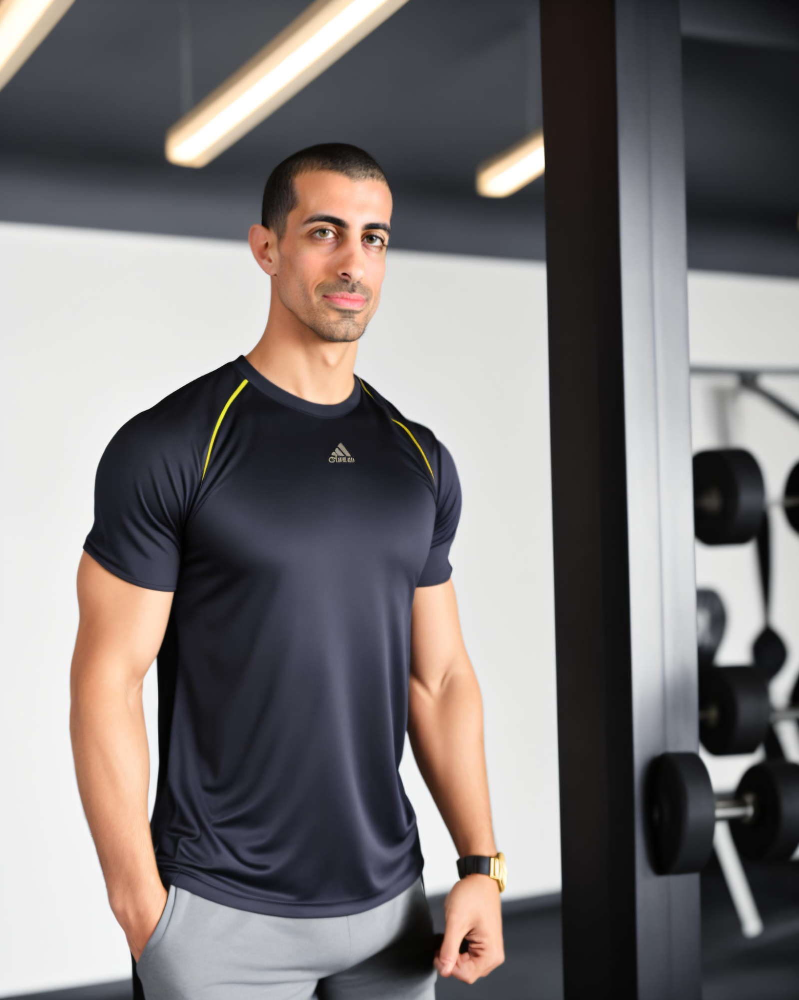
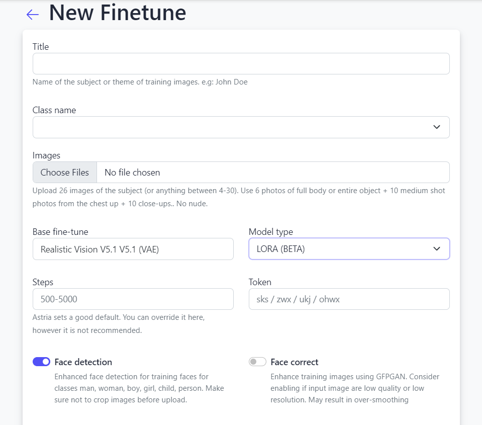
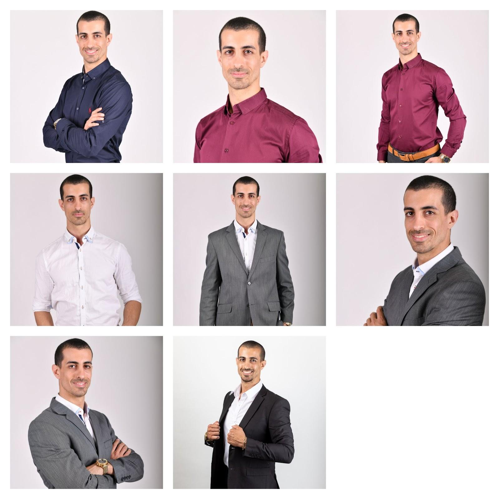
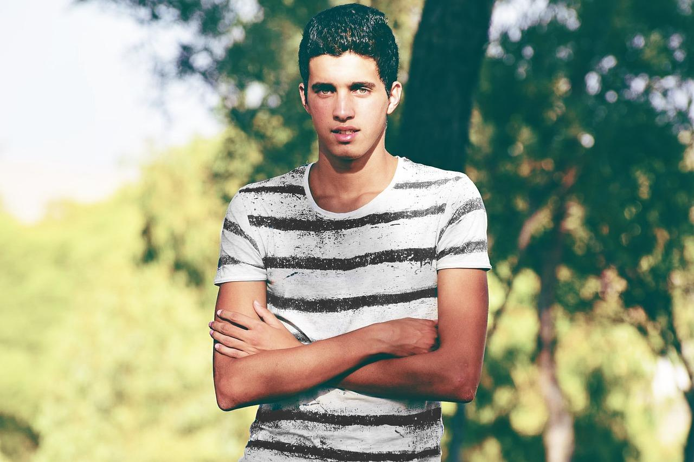
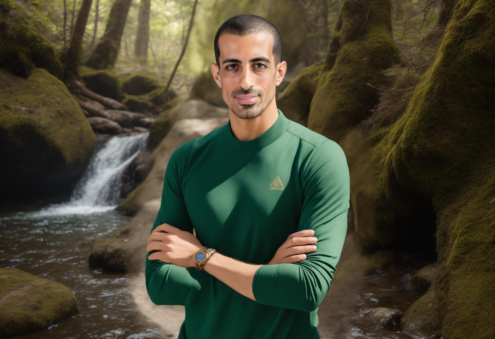
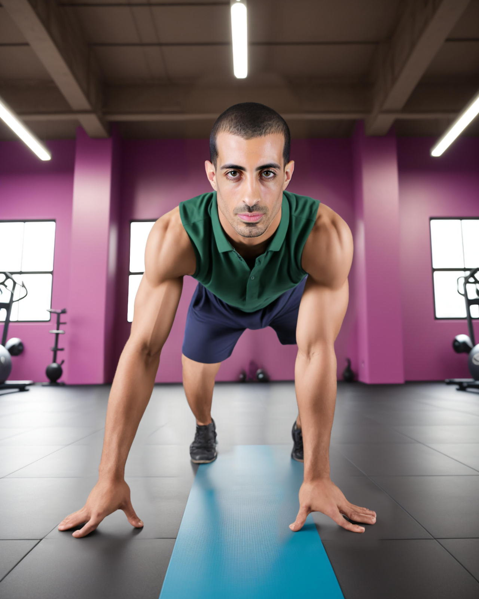
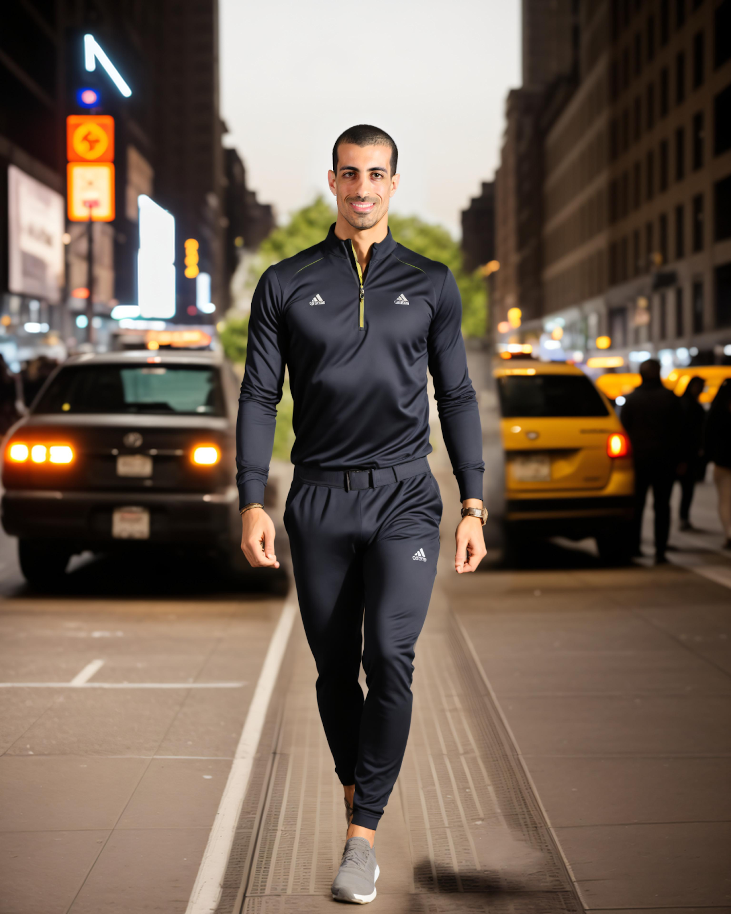

# How to Use Astria.ai's Multi-Pass Inference for Highly Controlled Stable Diffusion Image Generation

Welcome to Astria.ai.

In our first blog post, we’ll take a deep dive into how you can generate very detailed images using a multi-pass inference method. We’ll show you how to structure high-quality prompts to generate visuals of professional quality.


## What Is Multi-Pass Inference?

First, let’s discuss what multi-pass inference is. Multi-pass inference is essentially a technique where you can generate the background of the composition independently from the foreground. On Astria.ai this control is achieved through multiple breaks in the prompting technique. The base image (i.e. the background elements) is generated separately via the first part of the prompt. Then using the next breaks in the prompt the subject is in-painted onto the base image.

Here's how multi-pass inference enhances control over the background of an image:


### 1. Iterative Refinement

In a multi-pass inference, you have the opportunity to adjust and refine the background in a separate pass. This iterative process allows you to steer the image generation towards your desired outcome.


### 2. Choice over base model

Multi-pass inference allows for choice over the base model thereby giving the users the option to use a variety of pre-trained models like Realistic Vision, Absolute Reality, and other Stable Diffusion models.


### 3. Increased Precision and Detailing

With multiple inference steps, you have more chances to introduce specific details or adjustments to the background. This can include changing its color scheme, adding or removing elements, or altering its overall style. Such precision is often not achievable in a single pass, where the model's output is more dependent on the initial prompt and less on a multi-step method.


### 4. Balancing Foreground and Background

Multi-pass inference allows for a more balanced composition between the foreground and the background so that you can modify the background in a way that it complements the foreground elements more effectively.

As an example take a look at these two images of a man wearing sportswear and posing inside a gym. The first one was generated in a single prompt, while for the second one we used a multi-pass approach.

<div style={{ display: "grid", 'grid-template-columns': '1fr 1fr', gap: '1.5rem' }}>

<div>
<figcaption>Without multi-pass</figcaption>


</div>

<div>
<figcaption>With multi-pass</figcaption>


</div>  

</div>


As you can see in the second image the background has more character to it. The elements of the gym are more prominent as compared to the former.


## How Multi-Pass Inference Can Benefit Your Business

The enhanced control over image backgrounds provided by multi-pass inference offers significant benefits for businesses in various domains. By precisely tailoring image backgrounds, companies can maintain a consistent visual brand identity, crucial for marketing, advertising, and establishing a strong social media presence.

For e-commerce and retail sectors, the background of product images plays a critical role in shaping customer perception. Tailoring these backgrounds to complement the products not only enhances their appeal but also provides clearer context, which can lead to increased sales.

Moreover, multi-pass inference enables rapid and cost-effective creation of high-quality, bespoke images. This reduces the reliance on expensive photoshoots and graphic design work, presenting a more economical approach to content creation. Businesses can easily modify image backgrounds to suit various platforms and formats, such as social media, websites, and print media, ensuring optimal visual presentation across all channels.

Lastly, in a digital landscape overflowing with visual content, unique and tailored images with custom backgrounds provide businesses with a competitive edge. Such visuals are more likely to capture audience interest in a crowded market, standing out from standard, generic content. Therefore, the ability to control image backgrounds through multi-pass inference is not just a technical advantage but a strategic tool for branding, marketing, product presentation, and creating visually compelling content that differentiates a business in the market.


## How Astria.ai makes Multi-pass inferencing easy

Multi-pass inferencing, particularly in the context of advanced generative models like Stable Diffusion, often requires a developer's expertise due to several technical complexities. At Astria.ai, we provide a user-friendly apis that can significantly simplify this process for users who do not possess extensive technical know-how.

Let’s first understand how a developer’s expertise is needed and then we’ll show how Astria.ai makes this process easier.

If one were to fine-tune and implement Stable Diffusion for multi-pass inferencing one would need a fair understanding of how these machine learning models work so that they can adjust parameters for different passes. This would require a fair amount of coding skills especially for customizing the inference process, integrating different components (like schedulers, encoders, decoders), and handling data preprocessing and postprocessing. Developers must be proficient in relevant programming languages and frameworks.

Moreover each pass in multi-pass inferencing may require adjustments to optimize the output. Developers need to troubleshoot issues, fine-tune parameters, and experiment with different configurations to achieve the desired results, which demands both technical skills and problem-solving abilities. Lastly, generative models can be resource-intensive. Developers need to manage and optimize the use of computational resources like GPUs, especially when working with large models or high-resolution images.

Astria.ai simplifies the above procedures by providing simple APIs that abstract the complexities of the underlying model. The platform also comes with pre-configured settings and templates showcased in the gallery that users can select from, reducing the time to do prompt engineering, and helping understand the breadth of options available. This includes predefined prompts, styles, and optimization settings. Apart from this Astria also handles the computational resource management in the background, allowing users to focus on the creative aspects of image generation without worrying about technical constraints.

Overall, while multi-pass inferencing with AI models requires considerable technical expertise due to its complexity, a platform like Astria.ai democratizes this capability by providing easy-to-use api and automated workflows, making advanced image generation accessible to developers.


## Step-by-Step Guide to Creating Images for a Sportswear Brand Using Multi-Pass Inferencing

### Step 1: Training

First, create a fine-tune of your subject.




Select the model type as LORA. This is a fast and efficient way to train the model, as it only trains an adapter layer on top of the base model, instead of training all the weights which is typically the case if we select the Checkpoint Model type.

We used the following images of a male model obtained from a royalty free collection (Pixabay):





Once the tune is ready, we can begin to prompt. Click on your tune.


### Step 2 Inference

Let’s first look at the structure of our prompt. Suppose you have to create images to market a sportswear brand.


```
(medium shot) of a male model wearing hiking clothes and shoes, standing in a dense forest, behind him is a small waterfall.
BREAK photorealistic and highly detailed
BREAK ohwx man wearing hiking clothes and shoes <lora:960310:1.0>
```

* The first line contains the base prompt to generate the background and the overall composition.
* The second line is a common prompt that is added both to the base prompt and the person prompt, in order to avoid repetition.
* The third line is the person prompt, to detail how our subject is composed in the foreground. The statement - &lt;lora:960310:1.0> - is added to load the fine-tuned model of our subject.

```
Negative Prompt: (brand logos on t-shirt), (worst quality, greyscale), watermark, username, signature, text, bad anatomy, bad hands, text, error, missing fingers, extra digit, fewer digits, cropped, jpeg artifacts, bad feet, extra fingers, mutated hands, poorly drawn hands, bad proportions, extra limbs, disfigured, bad anatomy, gross proportions, malformed limbs, missing arms, missing legs, extra arms, extra legs, mutated hands, fused fingers, too many fingers, long neck
```


The negative prompt is a list of prompts we want to avoid in our generated image. Anything placed in parentheses applies extra weights to that prompt.

We can add an input image if we want our generated image to follow an input template. On the ControlNet Hint dropdown menu, we can select pose, if we want to copy the pose of the subject from the input image. Select the Text2img toggle to be true, that’ll preserve the pose of the image. (recommended). If you want the semantics i.e. the looks and feels of the original image as well, then go for Img2img.

For example, let’s take this pose as our input image:





Also, keep the Inpaint Faces and Face Swap toggle on. Inpaint Faces iterates one more time over the faces of the subject to ensure that there is no distortion in the outcome, while the Face Swap option ensures that the face of our model is taken from the training images and swapped in the generated image to enhance resemblance in the final output.

Let’s look at the result of our first prompt:





As you can see, the ControlNet has ensured that the output pose is similar to the pose of the input image.

### Step 3: Examples

Prompt 2:
```
a man at the finish line of a race on an olympic track
BREAK sharp details
BREAK ohwx man wearing running clothes and shoes, jubilant expression on his face&lt;lora:960310:1.0>

Negative: anime, cartoon, graphic, text, painting, crayon, graphite, abstract, glitch, deformed, mutated, ugly, long neck, disfigured, fused lips,
```


Prompt 3:

```
full body workout in a vibrant gym, action, perspective, speed, movement, ripped, push ups fit
BREAK sharp details, realistic image, Porta 160 color, ARRI ALEXA 65
BREAK ohwx man doing push-ups, intense look on his face <lora:960310:1.0>

Negative: anime, cartoon, graphic, text, painting, crayon, graphite, abstract, glitch, deformed, mutated, ugly, long neck, disfigured, fused lips,
```




Prompt 4:
(wide shot) of a man walking at night on the streets of New York, warm lighting, photorealistic

```
BREAK
BREAK ohwx man wearing casual sports wear&lt;lora:960310:1.0>
Negative: hat, cartoon, ugly
```





## Final Note

The above steps can be used to generate product photography or e-commerce images. With multi-pass inference, you can gain a huge amount of control over your image backgrounds vis a vis the foreground. This technique allows you to iteratively refine and tailor the background details, ensuring that they align with your vision and objectives.

Whether you're looking to create images for branding, marketing, storytelling, or artistic expression, multi-pass inference by Astria.ai provides the flexibility and precision to shape the background just as you need it. You can now harness this tool to bring depth, context, and nuance to your visual content, making your image speak in harmony with your creative goals.
