# Generate On-Brand Corporate Headshots in Minutes by Fine-Tuning Stable Diffusion Models on Astria.ai


Today, we’ll demonstrate how you can generate on-brand corporate headshots of yourself, your colleagues and clients using Astria.ai. You no longer need to dress up and conduct photoshoots; we can help you create professional-looking photos for your website, newsletter, PR, social media, and more simply with the help of a few prompts.


# Why Are On-Brand Photographs Necessary?

On-brand photographs are important because they visually communicate a brand's identity and values. Companies benefit from professional headshots for several reasons:


* **Projecting a Professional Image:** A polished headshot makes a strong first impression. It shows clients and potential customers that the company takes itself seriously and is invested in presenting a professional image.
* **Building Trust and Credibility:** Seeing the faces of the people behind the company helps build trust and credibility. Potential clients feel more comfortable doing business with a company that has a human face.
* **Enhancing Your Brand:** Headshots can be used on a company website, social media platforms, and marketing materials. Consistent, high-quality headshots contribute to a company's overall brand identity.
* **Recruiting Talent:** Professional headshots on a careers page can attract qualified candidates. It shows potential employees that the company is professional and cares about its image.
* **Boosting Employee Morale:** Investing in professional headshots can boost employee morale. It shows that the company values its employees and wants to present them in the best light.

_Off-Brand Photos vs. On-Brand Photos_


* **Off-brand:** Poor lighting, unprofessional attire, cluttered backgrounds, or generic stock photos that don't reflect the company's unique style.
* **On-brand:** Photos that use the company's color palette, incorporate the logo subtly, and look formal in a setting that reflects the company culture (casual startup vs. traditional office).

Think of on-brand photos as the building blocks of your company's visual story. They shape how the world perceives you, your work, and your brand’s values.

The following are examples of off-brand images: walking in the park, listening to music, playing ukulele, or reading a book.


<div style={{ display: "grid", 'grid-template-columns': '1fr 1fr', gap: '1.5rem' }}>
<div>

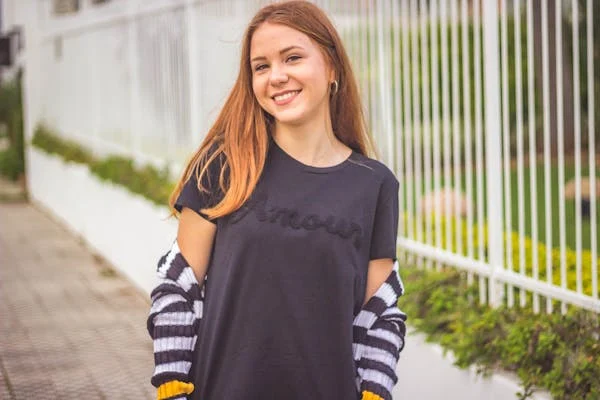

</div>
<div>

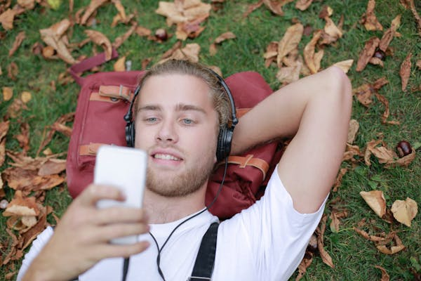

</div>
<div>
A woman walking in a park
</div>
<div>
A man listening to music in a park
</div>
</div>


<div style={{ display: "grid", 'grid-template-columns': '1fr 1fr', gap: '1.5rem' }}>
<div>


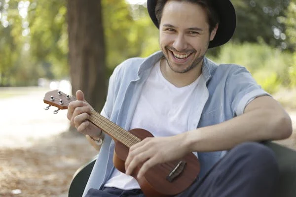

</div>
<div>

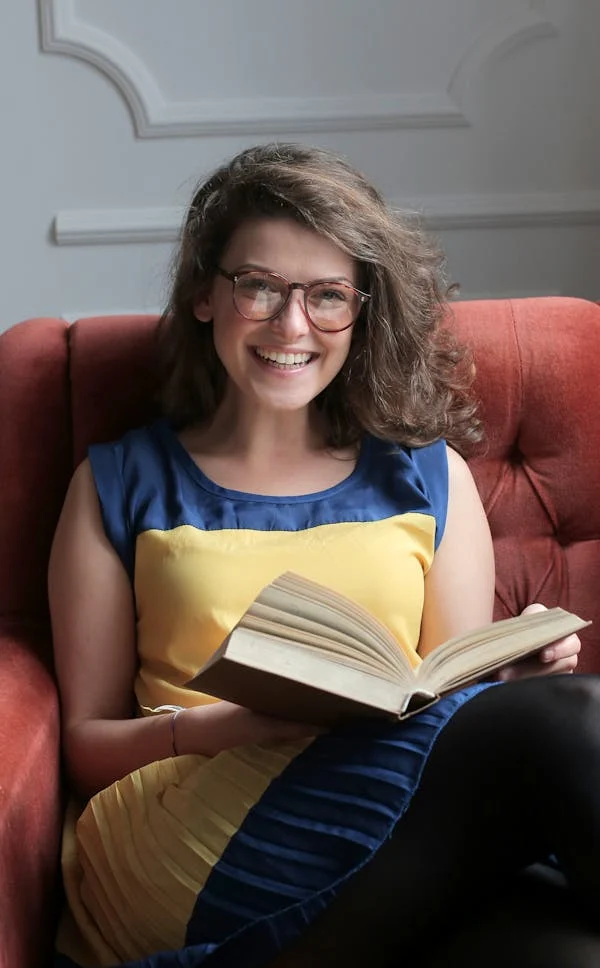

</div>
<div>
A man playing Ukulele
</div>
<div>
A woman reading a book
</div>

</div>


#### On-brand headshots of these same people would look something like this:

<div style={{ display: "grid", 'grid-template-columns': '1fr 1fr', gap: '1.5rem' }}>
<div>

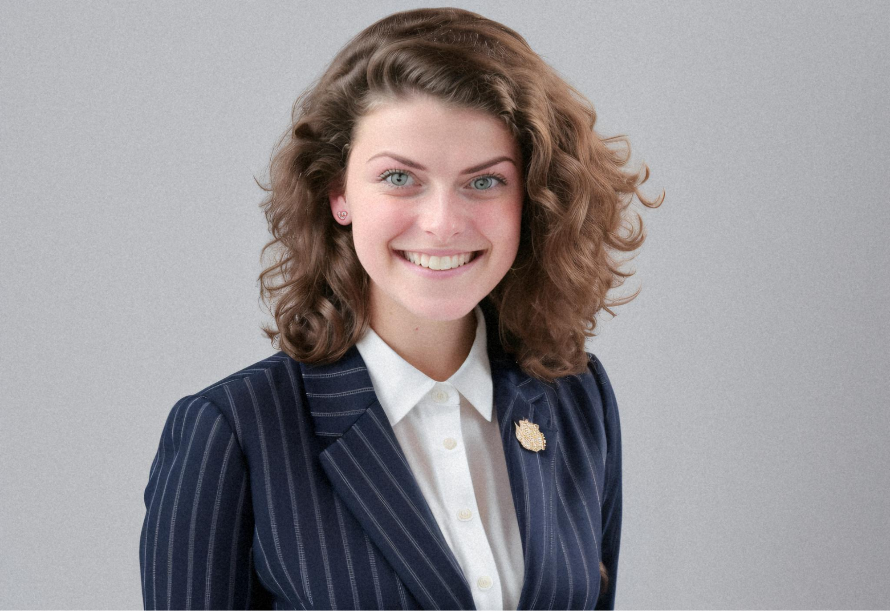
</div>
<div> 

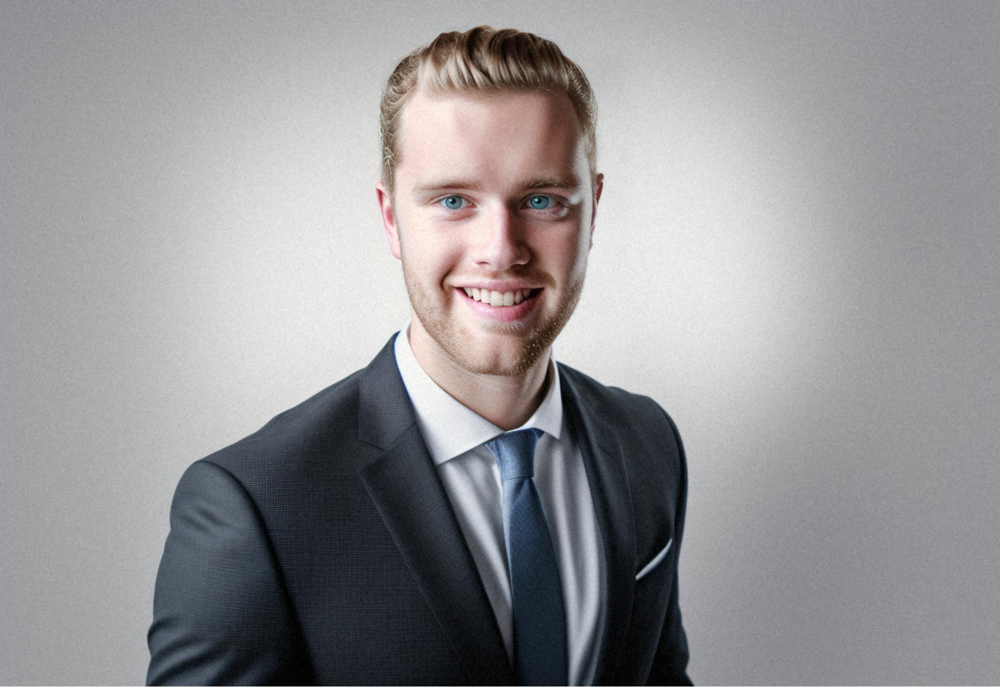
</div>
</div>

<div style={{ display: "grid", 'grid-template-columns': '1fr 1fr', gap: '1.5rem' }}>

<div>

      
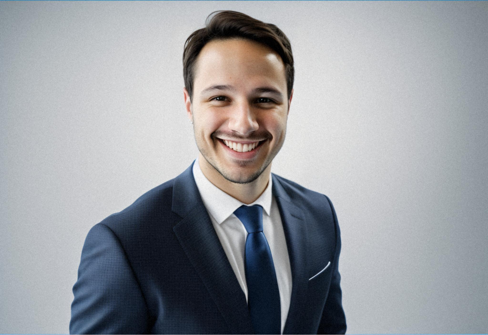


</div>

<div>

      
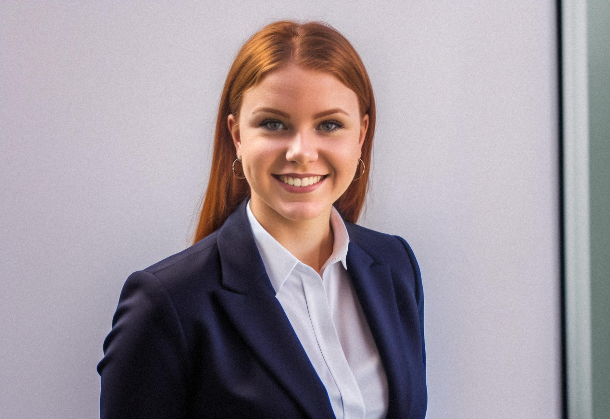


</div>

</div>


Now, wouldn’t it be awesome if you could generate corporate headshots like these quickly and efficiently?

That’s where we, Astria.ai, come in.


# Key Features of Astria.ai’s Platform

Astria.ai specializes in generating Stable Diffusion images at breakneck speed. First, you get premium results. Second, you can bring your still photographs to life. Third, our API is quick and simple to use. Our key features are:


1. **Backend V1:** Currently in beta, this feature helps you to completely rewrite the original image inference and processing pipeline. See the details [here](https://docs.astria.ai/docs/features/backend-v1).
2. **Face Inpainting:** Face inpainting will try to detect a human face in the picture, and then run a second inference on top of the detected face to improve facial features. It requires the super-resolution toggle to be turned on in order to get more pixels to work with.
3. **Face Swap**: Face-swap uses training images to enhance resemblance to the subject.
4. **Face ID:** This is a model adapter allowing you to generate an image while preserving identity without fine-tuning. It’s been trained on only human faces.
5. **Latent Consistency Models:** This is a combination of a scheduler and a LoRA which allows image generation in 5-6 steps, thus reducing processing time.
6. **LoRAs:** LoRAs can be used to improve the quality of the image or deepen the desired style. We provide a [LoRA gallery](https://www.astria.ai/gallery/tunes?model_type=lora) and allow importing external LoRAs.
7. **Multi-Controlnet:** Use this tool to get better consistency and precision. See the syntax [here](https://docs.astria.ai/docs/features/multi-controlnet).
8. **Multi-Pass Inference:** Currently in beta, this is a unique feature that allows you to generate a background image separately from the person in the foreground.
9. **Multi-Person Inference:** Also in beta, it is a feature that allows you to generate images with multiple people in them.
10. **Prompt Masking:** This uses a short text to create a mask from the input image. The mask can be used to inpaint parts of the image. The most popular use cases are [product shots](https://docs.astria.ai/docs/use-cases/product-shots) and [Masked Portraits](https://docs.astria.ai/docs/use-cases/masked-portraits).
11. **Tiled Upscale:** A beta feature to improve image resolution.


# Step-by-Step Process to Generate On-Brand Headshots


### **Step 1: Collecting Images**

To get started, we collected images of 4 different people from the free image websites Pixabay and Pexels.


### **Step 2: Training**

Next, we will fine-tune all the 4 subjects.

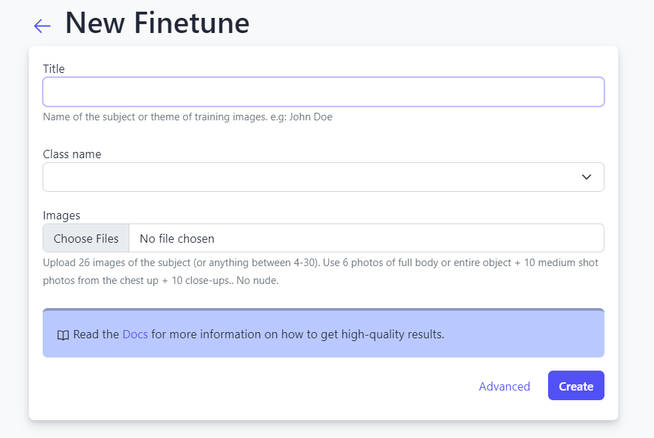


**Title:** Give an appropriate title.

**Class Name:** Select the correct class name from the dropdown menu. In our example, we have 2 male models and 2 female models, so we selected accordingly.

**Images:** You can upload any number between 4 and 30 images. In this case, we have:

*Male Model 1*: 20 images
*Male Model 2*: 14 images
*Female Model 1*: 7 images
*Female Model 2*: 6 images

**Advanced Options**


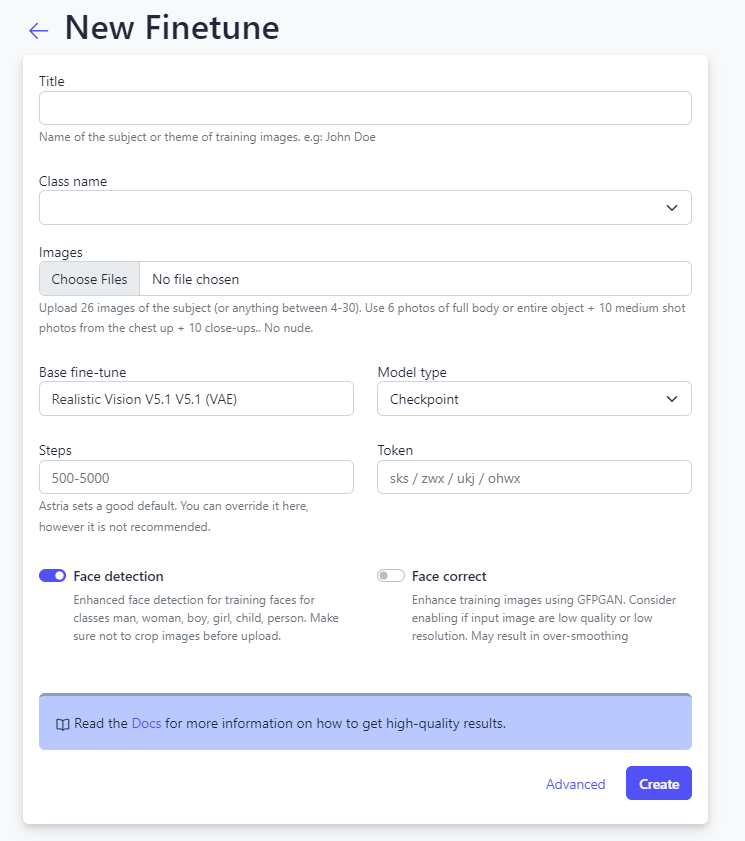


**Base Fine-tune:** We shall be using the Realistic Vision V5.1 V5.1 (VAE) model.

**Model Type:** Among Checkpoint, LoRA (BETA), LoRA + Embedding - SDXL, and FaceID (free) from the dropdown, we are choosing Checkpoint.

**Steps:** We advise going with the default setting here.

**Token:** The token used here is “ohwx”. Remember to use this for all Stable Diffusion prompts as an instance token for the naming process during training. “ohwx” is utilized as a token to associate subjects or concepts with specific identifiers during training.

**Face Detection:** This tool enhances face detection for training faces for different classes. Make sure not to crop the images before uploading.

**Face Correct:** This tool enhances training images when the input images are low quality or low resolution. But since it can result in over-smoothing, we have not opted for it.

To know more about the dos and don’ts of AI Photoshoots, visit our [documentation](https://docs.astria.ai/docs/use-cases/ai-photoshoot/).


### **Step 3: Creating On-Brand Images**

Now that the fine-tuned models are ready, we’re all set to generate some awesome headshots.


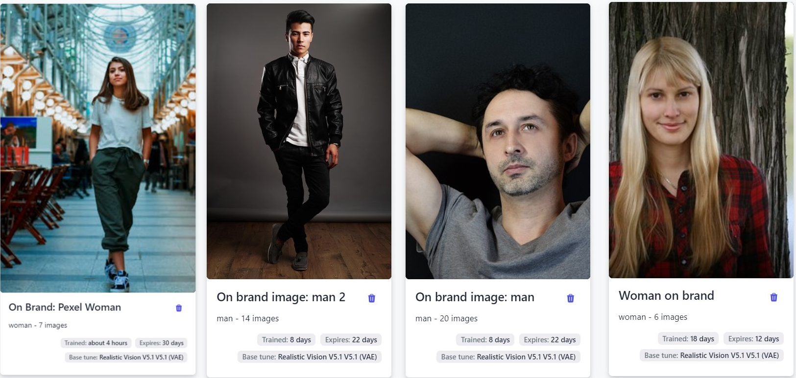


Let’s select the fine-tuned models one-by-one, and create the corresponding on-brand headshots.

Click on Fine-tune, then move to: On brand image: Pexel Woman.

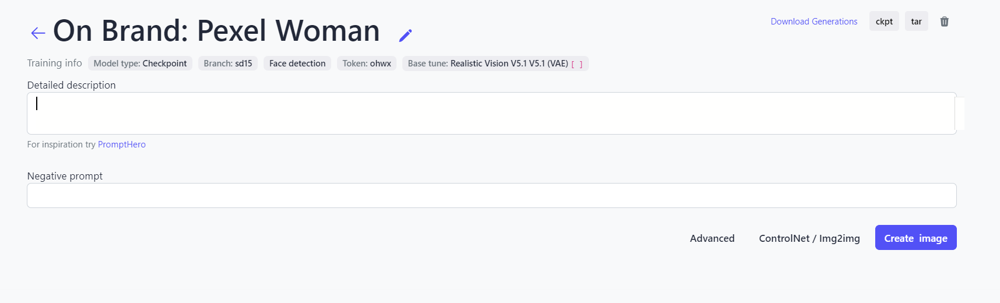


**Detailed Description:** Every image will require a different prompt. See the prompts we have used below.

**Negative Prompts:** This comprises the characteristics that you do _not_ want in your output images. In this case, we entered the following:


```
old, wrinkles, mole, blemish,(oversmoothed, 3d render) scar, sad, severe, 2d, sketch, painting, digital art, drawing, disfigured, elongated body (deformed iris, deformed pupils, semi-realistic, cgi, sketch, cartoon, drawing, anime), text, cropped, out of frame, worst quality, low quality, jpeg artifacts, ugly, duplicate, morbid, mutilated, (extra fingers, mutated hands, poorly drawn hands, poorly drawn face), mutation, deformed, (blurry), dehydrated, bad anatomy, bad proportions, (extra limbs), cloned face, disfigured, gross proportions, (malformed limbs, missing arms, missing legs, extra arms, extra legs, fused fingers, too many fingers, NSFW), nude, underwear, muscular, elongated body, high contrast, airbrushed, blurry, disfigured, cartoon, blurry, dark lighting, low quality, low resolution, cropped, text, caption, signature, clay, kitsch, oversaturated
```


**Model:** There are different Stable Diffusion models you can choose from. We used Realistic Vision V5.1 V5.1 (VAE).


#### **ControlNet/Img2Img**

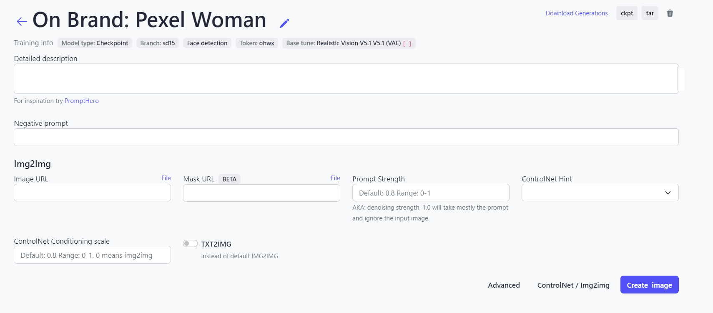

**Image URL:** This is the place to upload a reference image, or the image you would like the final output to be based on. You could also use a URL instead. In addition to the detailed description and negative prompts, the model will refer to this image while generating the new images.

**Mask URL:** Image masking is used to isolate specific areas of an image from the rest, allowing for more precise editing. It’s like placing a “mask” over the parts of a picture you want to protect or hide while exposing the other areas for editing. In this case, we have left it blank.

**Prompt Strength:** This is denoising strength. If you input 1 here, it will take the prompt and ignore the reference image. We are using the default: 0.8.

**ControlNet Hint:** In the dropdown you will note the following options: Pose, Depth, Tile, Line art - Edge, Canny - Edge detection, MLSD - for architecture, HED boundaries, and QR Code. We used ‘Pose’ because we are creating professional headshots.

**ControlNet Conditioning Scale:** We have used the default: 0.8.

**TXT2IMG:** If you want to use this instead of Img2Img, then toggle on. In our case, we have used a reference image, so it is toggled off.


#### **Advanced**

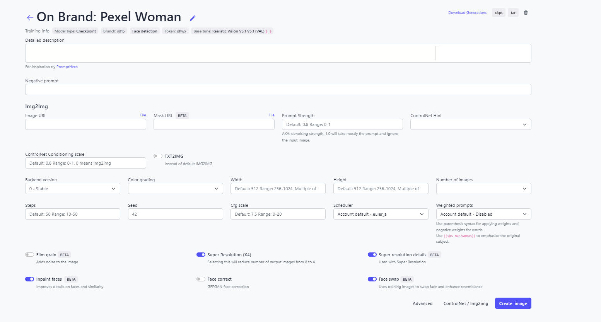


**Color Grading:** We have 3 color grading options - Film Velvia, Film Portra, and Ektar. In this case, we’ve left it blank so that the model can take the inference from the reference image.

**Width:** This will set the width of the image. We have left it blank.

**Height:** This will set the height of the image. We have left it blank.

**Number of Images:** The number of images can be selected from among the options - 1,2,3,4, and 8. We selected 2.

**Steps:** This ranges from 10 - 50. We have kept the default: 50.

**Seed:** The default is 42.

**Cfg Scale:** This ranges from 0-20; the default is 7.5.

**Scheduler:** Among euler, euler_a, dpm++2m_karras, dpm++sde_karras, dpm__2m, dpm++sde, and lcm, the default is euler_a. We’ve kept the default.

**Weighted Prompts**: You can enable the weighted prompts, but in our case, it is disabled.

**Film Grain:** This adds noise to the image. We toggled on.

**Super Resolution (X4):** This increases the resolution. We toggled on.

**Super Resolution Details:** This is used along with Super Resolution (X4). This is toggled on.

**Inpaint Faces:** This improves details on faces. It is toggled on.

**Face Correct:** This does face restoration. It is toggled on.

**Face Swap:** This uses training images to further enhance resemblance to the subject. This is toggled off.

Now let’s get to the detailed descriptions. Let’s see what prompts work and what headshots they generate - all of them on-brand in our case.


#### **On-Brand Image: Legal Profession**

Detailed Description for Man:


```
portrait of (ohwx man) wearing a lawyer suit, bookshelf background, professional photo, white background, Amazing Details, Best Quality, 80mm Sigma f/1.4 or any ZEISS lens --tiled upscale
```


Detailed Description for Woman:


```
portrait of (ohwx woman) wearing a lawyer suit, bookshelf background, professional photo, white background, Amazing Details, Best Quality, 80mm Sigma f/1.4 or any ZEISS lens --tiled upscale
```


Images:

<div style={{ display: "grid", 'grid-template-columns': '1fr 1fr', gap: '1.5rem' }}>
<div>

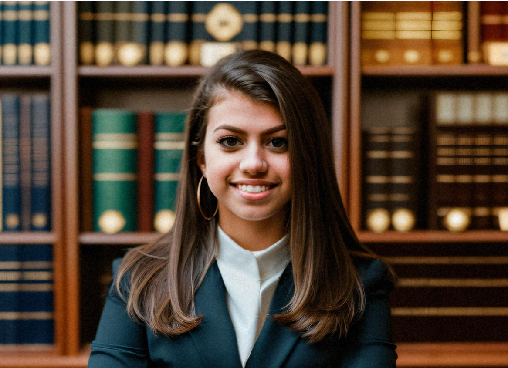

</div>
<div>

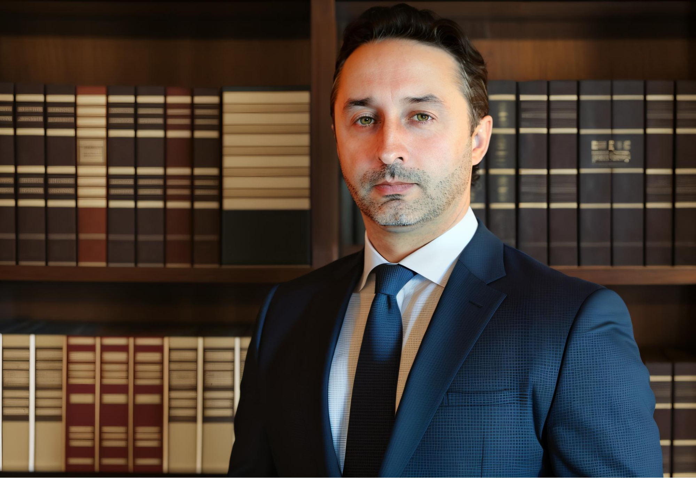

</div>
<div>


</div>
<div>


</div>
</div>


#### **On-Brand Image: Corporate Headshots**

Detailed Description for Man:


```
portrait of (ohwx man) wearing a business suit, professional photo, white background, Amazing Details, Best Quality, Masterpiece, dramatic lighting highly detailed, analog photo, overglaze, 80mm Sigma f/1.4 or any ZEISS lens
```


Detailed Description for Woman:


```
portrait of (ohwx woman) wearing a business suit, businesswoman, professional photo, white background, Amazing Details, Best Quality,  80mm Sigma f/1.4 or any ZEISS lens  --tiled upscale
```


Images:


<div style={{ display: "grid", 'grid-template-columns': '1fr 1fr', gap: '1.5rem' }}>
<div>


</div>
<div>

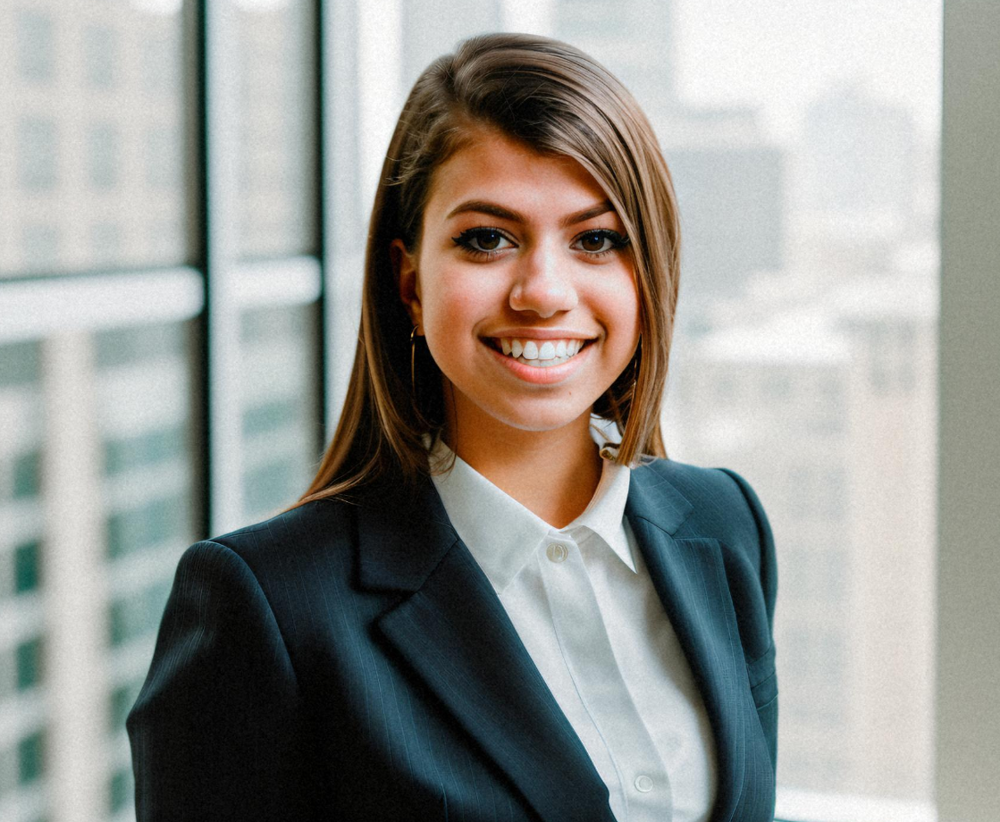

</div>
<div>

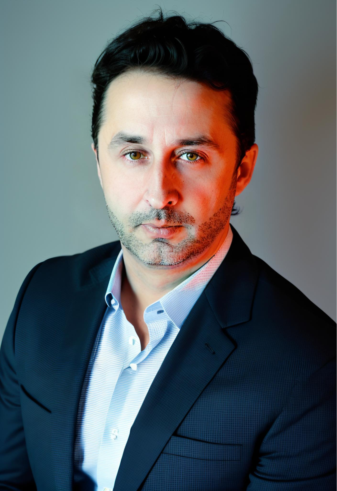

</div>
<div>


</div>
</div>


#### **On-Brand Image: Healthcare**

Detailed Description for Man:


```
portrait of (ohwx man) wearing a labcoat,smiling, hospital, intricate details, symmetrical eyes, professional photo, detailed background, detailed fingers, detailed face,  Amazing Details, Best Quality,  ZEISS lens,8k high definition  --tiled upscale
```


Detailed Description for Woman:


```
portrait of (ohwx woman) wearing a labcoat,smiling, hospital, intricate details, symmetrical eyes, professional photo, detailed background, detailed fingers, detailed face,  Amazing Details, Best Quality, ZEISS lens, 8k high definition --tiled upscale
```


Images:


<div style={{ display: "grid", 'grid-template-columns': '1fr 1fr', gap: '1.5rem' }}>
<div>

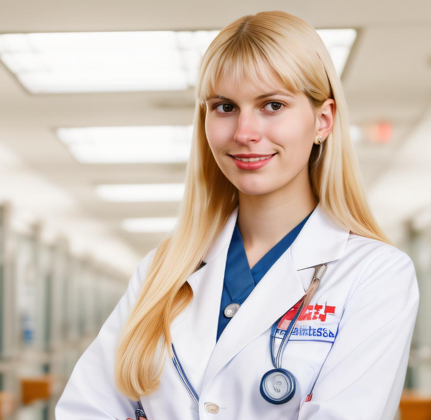

</div>
<div>


</div>
<div>

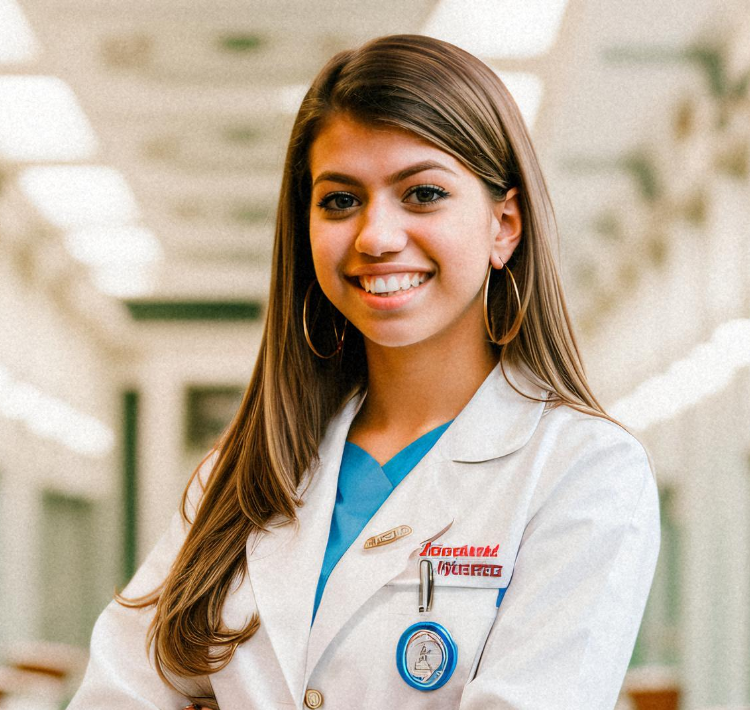

</div>
<div>

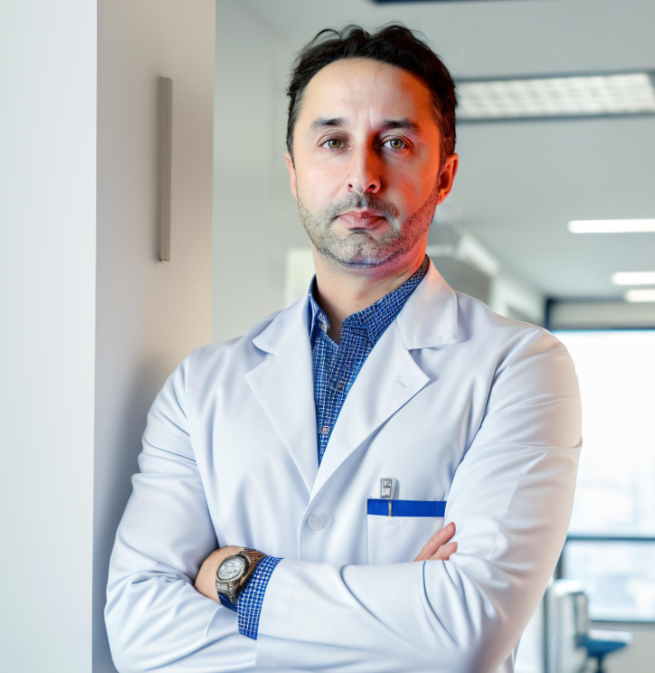

</div>
</div>


#### On-Brand Image: Manufacturing

Detailed Description for Man:


```text
portrait of (ohwx man) wearing shirt and trousers,factory background, manufacturing professional,smiling, symmetrical eyes,detailed fingers, detailed hands, professional photo, Amazing Details, Best Quality, 80mm Sigma f/1.4 or any ZEISS lens --tiled upscale
```


Detailed Description for Woman:


```text
portrait of (ohwx woman) wearing shirt and trousers,manufacturing professional,smiling, symmetrical eyes,detailed fingers, detailed hands, professional photo,  Amazing Details, Best Quality,  80mm Sigma f/1.4 or any ZEISS lens --tiled upscale
```


Images:


<div style={{ display: "grid", 'grid-template-columns': '1fr 1fr', gap: '1.5rem' }}>
<div>


</div>

<div>

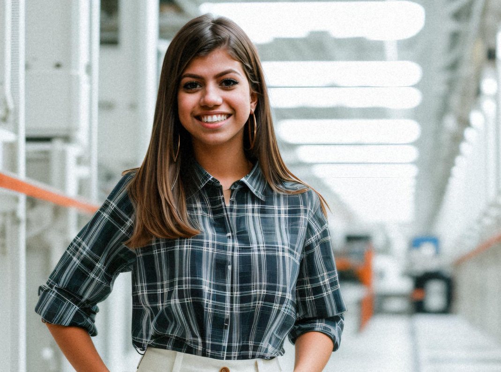
</div>

<div>


</div>
<div>

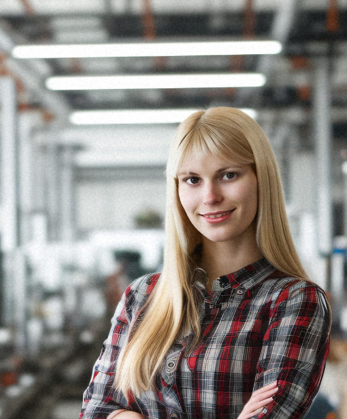
</div>
</div>


# To Summarize

There are several potential benefits to using Astria for corporate headshots over traditional photography shoots:


* **Cost-Effectiveness:** AI-generated headshots can be significantly cheaper than hiring a professional photographer, renting a studio, and so on
* **Scalability:** AI can generate a large number of headshots quickly and easily. This is especially beneficial for companies with a large number of employees.
* **Customization:** With AI, you can fine-tune the generation process to create headshots that meet your specific needs. For example, you can specify the desired clothing, background, and lighting.
* **Control over Revisions:** If you don't like an AI-generated headshot, you can simply generate another one. This can save time and money compared to reshooting a traditional headshot.
* **Accessibility:** AI-generated headshots can be created from anywhere in the world, without the need to travel to a photography studio.

Generating corporate headshots is one of the many cool things you can do on our platform. Keep reading our other blogs to find out about our exciting new features.
