# Enhancing Real Estate Listings with Virtual Staging on Stable Diffusion

Virtual staging is the process of digitally adding furniture, decor, and other elements to photos of empty or sparsely furnished spaces. Along with Stable Diffusion, it can significantly improve real estate listings by creating realistic and attractive virtual staging.

Digital staging transforms cold, empty rooms into warm, inviting spaces that help buyers emotionally connect with a property. A 2023 report by Realtor.com found that staged homes sell 88% faster and for an average of 20% more than non-staged homes.


# Why Virtual Staging Is Needed


* Empty spaces lack appeal: Unfurnished rooms can appear cold and uninviting, making it difficult for potential buyers to visualize themselves living in the space.
* Traditional staging is expensive: Physically staging a property requires furniture rentals, which can be costly and time-consuming.
* Showcases potential: Virtual staging allows showcasing a space's full potential. Buyers can see how furniture can be arranged and how the space can function for their needs.


# Advantages of Using Astria.ai for Virtual Staging

The advantages of using Astria.ai for virtual staging are many:


* Cost-Effective: Compared to traditional staging, Astria offers a much more affordable way to virtually stage a property.
* Speed and Efficiency: Astria can generate virtual staging variations in minutes, allowing realtors to experiment with different styles and layouts.
* Customization: With clear prompts and descriptions, it can create virtual staging that reflects the property's style, target demographic, and current design trends.

Astria.ai simplifies virtual staging by harnessing cutting-edge AI technology, making it effortless to digitally stage listings with realistic results. Here's how Astria.ai achieves this:


1. Controlnets: Users input text descriptions to control the composition, style, and content of the staged photo.
2. MLSD (Multi-Level Scene Description): Breaks down a room into its components, ensuring realistic staging.
3. Compositional Understanding: AI arranges furniture and decor based on interior design principles.
4. Backend Version-1: Proprietary machine learning infrastructure enables fast, high-quality staging.

Backend Version-1 improvements include:


* Hi-Res (Super-Resolution Details) for sharper images.
* Faster processing times.
* Better handling of multiple LoRAs.
* Improved results with DPM++/Karras and DPM++SDE/Karras samplers.

Multi-Controlnet, available only for Backend Version-1, combines multiple Controlnets for better consistency and precision.


# How to Use Astria.ai


1. Sign up at Astria.ai.
2. Go to [https://www.astria.ai/prompts](https://www.astria.ai/prompts).
3. Select Advanced and ControlNet/Img2Img Option.


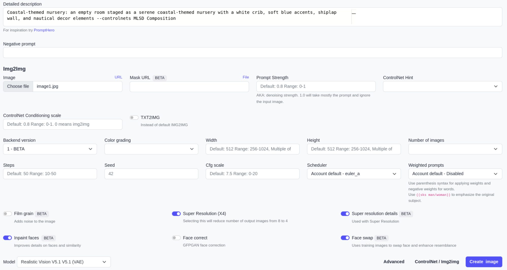


4. Upload your image using Choose File.
5. Select 1 - BETA under Backend version.
6. Write out a description under Detailed Description and add “-- controlnets MLSD” at the end of it. --controlnet_weights 0.5 gives the best results.
7. Also use --mask_prompt windows door --mask_invert, to make sure that the windows and the doors are preserved from the original image.
8. Additionally you can add a few Loras as suggested in the docs [here ](https://docs.astria.ai/docs/use-cases/room-redesign)to improve the overall quality of the image.
9. Click Create Image.


# Easy Hacks to Enhance Your Listings


1. Gather High-Quality Photos: The process works best with clear and well-lit photos of the empty rooms.
2. Define the Virtual Staging Style: Consider the property's target audience and the overall feel you want to create (modern, traditional, family-friendly etc.).
3. Craft Text Prompts: Provide detailed descriptions of the desired furniture, decor, and overall ambiance.
4. Generate Variations: You can generate multiple virtual staging options to choose from, allowing for A/B testing to see which resonates best with potential buyers.
5. Refine and Integrate: Minor adjustments might be needed to ensure a seamless integration of the virtual staging with the original photo.


# Virtual Staging Applications on Astria.ai

In this section, let’s look at how you can actually use Astria to transform empty spaces into vibrant, inviting rooms.

See below:

**Original Image => AI Generated Image by Astria.ai**

```text
A serene and opulent private bedroom, featuring a plush king-size bed with a tufted velvet headboard and a delicate crystal chandelier above, surrounded by richly textured walls in a soothing gray tone, and a lavish area rug in a soft, creamy color, with a comfortable reading nook by the window, complete with a oversized armchair and a matching ottoman, and a spacious walk-in closet with custom cabinetry and a marble-topped dresser, all bathed in a warm, golden light, in a 3D rendering style &lt;lora:epi_noiseoffset2:0.5>&lt;lora:FilmVelvia2:0.5>&lt;lora:add_detail:0.5>&lt;lora:epiCRealismHelper:0.2> --mask_prompt windows door --mask_invert --controlnets mlsd --controlnet_weights 0.5
```


<table>
  <tr>
    <td>

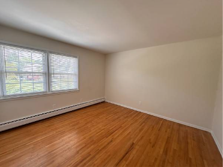

</td>
    <td>

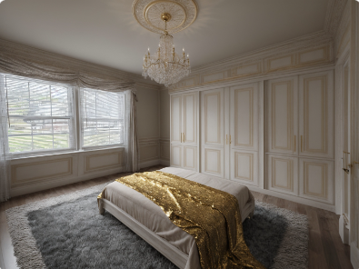

</td>
  </tr>
</table>


```text
A modern office room with a minimalist aesthetic, featuring a sleek wooden desk with a silver laptop and a ergonomic chair, surrounded by floor-to-ceiling windows with a cityscape view, and a few potted plants on a shelf, with walls lined with tall cabinets filled with neatly organized books and files, and a subtle warm lighting and a hint of natural light, in a 3D rendering style &lt;lora:epi_noiseoffset2:0.5>&lt;lora:FilmVelvia2:0.5>&lt;lora:add_detail:0.5>&lt;lora:epiCRealismHelper:0.2> --mask_prompt windows door --mask_invert --controlnets mlsd --controlnet_weights 0.5
```


<table>
  <tr>
    <td>

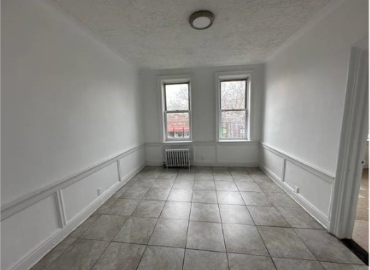

</td>
    <td>

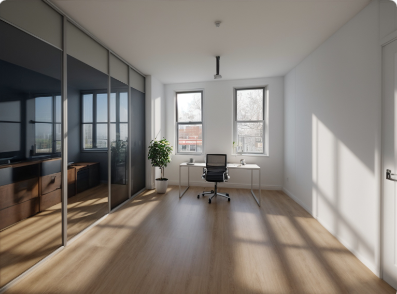

</td>
  </tr>
</table>


A contemporary office space with an industrial chic vibe, featuring a reclaimed wood desk with a vintage-inspired lamp and a worn leather office chair, surrounded by exposed brick walls and polished concrete floors, with a floor-to-ceiling metal shelving unit filled with vintage books and decorative objects, and a large glass door leading to a private outdoor patio with a city view, in a 3D rendering style &lt;lora:epi_noiseoffset2:0.5>&lt;lora:FilmVelvia2:0.5>&lt;lora:add_detail:0.5>&lt;lora:epiCRealismHelper:0.2> --mask_prompt windows door --mask_invert --controlnets mlsd --controlnet_weights 0.5


<table>
  <tr>
    <td>

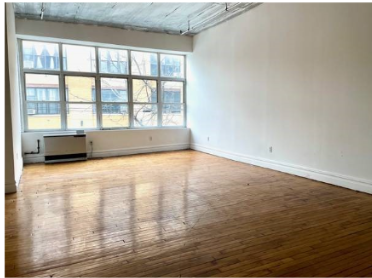

</td>
    <td>

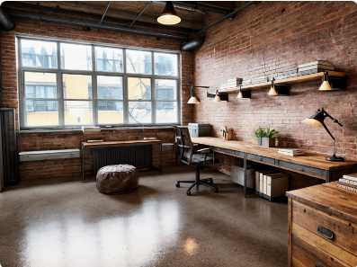

</td>
  </tr>
</table>


```text
A sleek and modern home gym, featuring a spacious open floor plan with high ceilings and large windows allowing for natural light, equipped with a variety of high-end exercise equipment including a treadmill, stationary bike, and free weights, surrounded by mirrored walls and a polished wood floor, with a comfortable seating area for relaxation and a large flat-screen TV for entertainment, and a modern sound system for an immersive workout experience, in a 3D rendering style
```


<table>
  <tr>
    <td>

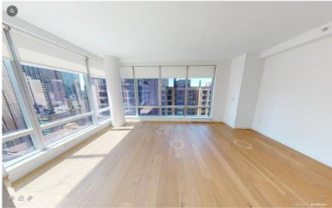

</td>
    <td>

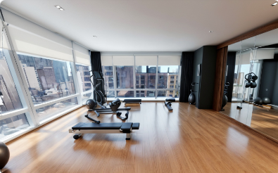

</td>
  </tr>
</table>


```text
Coastal-themed nursery: an empty room staged as a serene coastal-themed nursery with a white crib, soft blue accents, shiplap wall, and nautical decor elements – controlnets MLSD Composition
```


<table>
  <tr>
    <td>

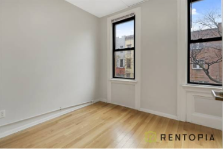

</td>
    <td>

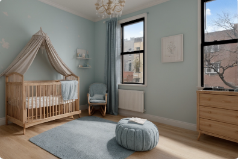

</td>
  </tr>
</table>


```text
A peaceful and calming meditation room, featuring a serene and minimalist space with a focus on natural materials and textures, including a reclaimed wood floor, a stone feature wall, and a live edge wooden meditation bench, surrounded by floor-to-ceiling windows allowing for an abundance of natural light and a connection to nature, with a few carefully placed plants and a subtle water feature creating a sense of tranquility, and a soft, warm glow emanating from candles or string lights, in a 3D rendering style &lt;lora:epi_noiseoffset2:0.5>&lt;lora:FilmVelvia2:0.5>&lt;lora:add_detail:0.5>&lt;lora:epiCRealismHelper:0.2> --mask_prompt windows door --mask_invert --controlnets mlsd --controlnet_weights 0.5
```


<table>
  <tr>
    <td>

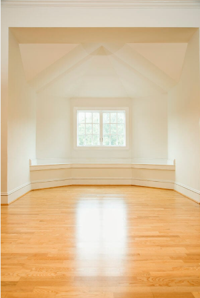

</td>
    <td>

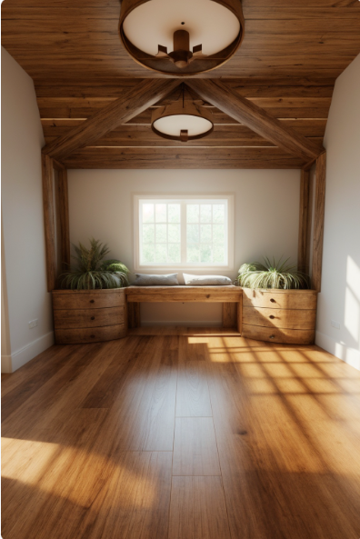

</td>
  </tr>
</table>


Here are the original images sources:

[https://newyork.craigslist.org/brk/apa/d/brooklyn-expansive-loft-in-bushwick/7731612663.html](https://newyork.craigslist.org/brk/apa/d/brooklyn-expansive-loft-in-bushwick/7731612663.html)

[https://newyork.craigslist.org/brk/apa/d/brooklyn-below-market-basic-bedroom/7731562165.html](https://newyork.craigslist.org/brk/apa/d/brooklyn-below-market-basic-bedroom/7731562165.html)

[https://newyork.craigslist.org/mnh/apa/d/new-york-bright-corner-studio-laundry/7731512365.html](https://newyork.craigslist.org/mnh/apa/d/new-york-bright-corner-studio-laundry/7731512365.html)

[https://newyork.craigslist.org/brk/apa/d/brooklyn-bed-in-williamsburg-no-fee/7731545442.html](https://newyork.craigslist.org/brk/apa/d/brooklyn-bed-in-williamsburg-no-fee/7731545442.html)

[https://hudsonvalley.craigslist.org/apa/d/pearl-river-pearl-river-jewel-1br/7733791169.html](https://hudsonvalley.craigslist.org/apa/d/pearl-river-pearl-river-jewel-1br/7733791169.html)

[https://slowmotionmama.com/7-reasons-to-empty-a-space-before-decluttering/](https://slowmotionmama.com/7-reasons-to-empty-a-space-before-decluttering/)


# To Summarize

The benefits of AI virtual staging are many: accelerated sales, increased property values, and a streamlined marketing experience.

Things to remember:


* Maintain Realism: While this AI tool is powerful, it's crucial to ensure the generated virtual staging looks realistic and avoids nonsensical elements.
* Transparency: You may choose to disclose that virtual staging is used in the listing description to build trust with potential buyers.
