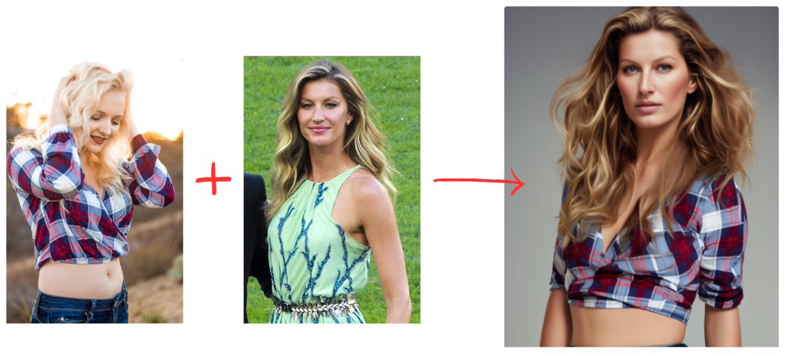
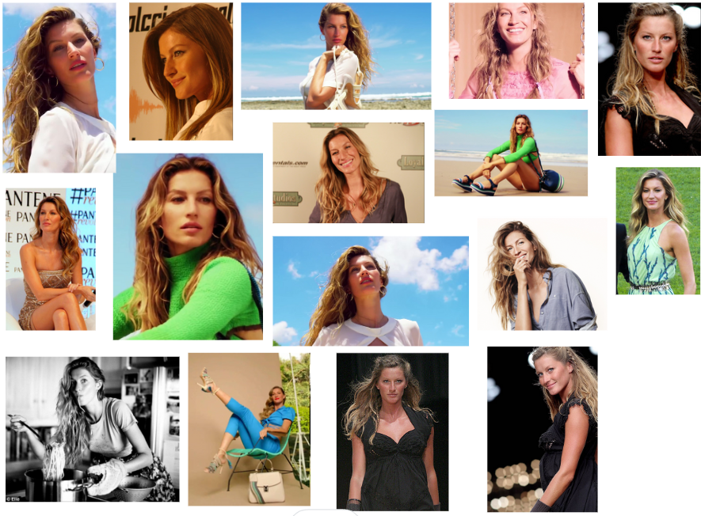
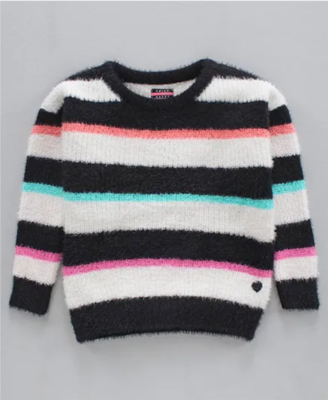

export const faqSchema = {
  "@context": "https://schema.org",
  "@type": "FAQPage",
  mainEntity: [
    {
      "@type": "Question",
      name: "What is virtual try-on?",
      acceptedAnswer: {
        "@type": "Answer",
        text: "The term covers two different things. Brand-side try-on places a garment on a model to produce imagery the brand publishes. Shopper-side try-on lets a customer see a garment on themselves in the storefront. They solve different problems and are bought by different teams.",
      },
    },
    {
      "@type": "Question",
      name: "Which type of virtual try-on do most brands need?",
      acceptedAnswer: {
        "@type": "Answer",
        text: "Brand-side, in most cases. It addresses the immediate and recurring cost of producing on-model imagery for every SKU and colorway. Shopper-side try-on is a conversion experiment that depends on traffic volume to pay back.",
      },
    },
    {
      "@type": "Question",
      name: "Does virtual try-on reproduce garments accurately?",
      acceptedAnswer: {
        "@type": "Answer",
        text: "Accuracy varies by garment. Simple silhouettes in solid colours reproduce reliably. Complex construction, directional prints, sheer fabrics, and fine hardware are where errors appear. Test your hardest garments before committing, not your easiest.",
      },
    },
    {
      "@type": "Question",
      name: "Do I need to disclose AI-generated model imagery?",
      acceptedAnswer: {
        "@type": "Answer",
        text: "Requirements vary by market and are changing. Several jurisdictions have introduced or proposed disclosure rules for synthetic imagery in advertising. Check current obligations for the markets you sell in, and treat disclosure as a brand decision as much as a legal one.",
      },
    },
    {
      "@type": "Question",
      name: "What is the difference between virtual try-on and an AI photoshoot?",
      acceptedAnswer: {
        "@type": "Answer",
        text: "Try-on is one operation: put this garment on a body. An AI photoshoot is the whole production — casting, styling, scene, lighting, crop, and format — applied consistently across a collection. Try-on is a feature inside that larger job.",
      },
    },
  ],
};

<script
  type="application/ld+json"
  dangerouslySetInnerHTML={{__html: JSON.stringify(faqSchema).replace(/</g, '\\u003c')}}
/>

Two genuinely different technologies are sold under the name "virtual try-on," and the confusion costs brands real money. One produces the imagery you publish. The other is a widget your customer interacts with. They have different buyers, different economics, and different failure modes.

**The short version:** if your problem is that producing on-model imagery for every SKU is slow and expensive, you want brand-side try-on — which is really a production question, not a fitting-room one.

<!-- truncate -->

<aside className="astria-article-cta" aria-label="Start creating with Astria">
  

    
  

  
Fashion production workspace

  <h2 className="astria-article-cta__title">Create your next campaign with Astria</h2>
  
Generate fashion visuals from your products, or start with a production-ready template.

  

    <a className="astria-article-cta__button astria-article-cta__button--primary" href="/prompts">
      Generate→
    </a>
    <a className="astria-article-cta__button astria-article-cta__button--secondary" href="/gallery/workspaces">
      Templates gallery→
    </a>
  

</aside>

## The two things called virtual try-on

**Brand-side try-on** takes a garment — a flat lay, a packshot, a sample on a hanger — and produces a photograph of a model wearing it. The output is an image file. It goes on the product page, in the lookbook, into the ad, onto Instagram. The buyer is whoever owns imagery: an ecommerce manager, a brand marketer, a studio producing for the brand.

**Shopper-side try-on** is an interface element. A customer uploads a photo or uses their camera, and sees the garment on their own body. The output is an experience, not an asset. The buyer is whoever owns conversion rate and returns.

Vendors blur this because the underlying image work rhymes. The purchasing decision does not rhyme at all.

## Why brand-side is where the money usually is

The arithmetic is unsentimental. A brand with 200 SKUs across three colorways needs on-model imagery for 600 variants, refreshed each season. Traditional production means model booking, studio time, a stylist, sample logistics, a photographer, and retouching — and the whole apparatus has to be re-run when a product drops late or a colorway is added.

That cost is certain, recurring, and proportional to catalog size. It is the kind of cost a tool can attack directly.

Shopper-side try-on attacks a different number: conversion rate and return rate. The upside is real — vendors in this space commonly cite meaningful reductions in fit-related returns — but it is a percentage improvement on traffic you already have. If you have a lot of traffic, that percentage is worth a great deal. If you do not, you have installed a widget.

Most brands have the imagery problem long before they have the traffic to justify the widget.

## Where the technology is reliable, and where it is not

Being specific about this matters more than any vendor demo, because demos are shot on the garments that work.

**Reliable:** solid-colour knits, tees, simple dresses, tailored pieces with clean lines, outerwear with defined structure. Standard studio and lifestyle scenes. Standard casting.

**Needs checking every time:** directional prints and stripes, which can mirror or misalign across a seam; logo placement and scale; sheer and semi-sheer fabrics; complex drape and gathering; fine hardware — buckles, zips, eyelets, chain straps; anything where the *construction* is the selling point.

**Still genuinely hard:** garments whose fit is the product — technical outerwear, structured tailoring, compression and performance wear, anything where a customer buys on how it sits rather than how it looks.

The practical rule: build your evaluation set out of your hardest ten garments, not a representative sample. A tool that handles those handles your catalog. A tool evaluated on your easiest ten tells you nothing you can plan around.

## Try-on is one operation inside a much bigger job

Here is the trap. Try-on answers "put this garment on a body." It does not answer any of the questions that actually make a catalog look like one brand:

- Which body? Whose casting, at what ages and sizes, and is it the same person across the collection?
- Lit how, and in what scene?
- Framed how — full length, three-quarter, detail crop — and in which aspect ratios for which channels?
- What happens in six weeks when the creative director wants a warmer grade across everything?

A tool that only does try-on leaves all four to be re-decided every session, by whoever happens to be at the keyboard. That is how catalogs drift: not through bad images, but through 600 individually-fine images that do not look like they came from the same brand.

The production framing treats the approved treatment — casting, styling, scene, crop, lighting, format — as the thing you store and reuse. The garment is the variable. Everything else is a decision you make once, approve once, and apply across the collection. When the creative director wants that warmer grade, it is one edit, not 600.

That distinction is covered in more depth in the [AI fashion photoshoot guide](./ai-fashion-photoshoot-guide.md) and, for the garment-specific workflow, in [flat lay to on-model](./flat-lay-to-on-model.md).

## A workable evaluation, in five steps

1. **Pick ten hard garments.** Prints, sheers, hardware, structured pieces. Not your bestsellers — your most awkward.
2. **Run them through every tool on your shortlist.** Same inputs, same day.
3. **Review blind, with a senior creative.** Garment fidelity first: is the print aligned, is the hardware right, does the drape read as this fabric? Then anatomy, then styling, then brand fit.
4. **Change something after approval.** Add a colorway. Change the crop convention. Count the operations each tool requires. This is the test most evaluations skip and the one that predicts your actual cost.
5. **Check what you own at the end.** Images only, or the casting, references, and approved treatment that produced them?

Step four is the one that separates a tool from a system. Producing the first image is easy everywhere. Producing the six-hundredth consistently, and changing your mind afterwards, is where the difference lives.

## Disclosure and casting

Two things worth deciding deliberately rather than discovering later.

**Disclosure.** Requirements for labelling synthetic imagery in advertising vary by market and are actively changing. Confirm current obligations for every market you sell into. Beyond compliance, decide what your brand wants to say about it — some brands are explicit and it costs them nothing; others treat it as a production detail like retouching.

**Casting.** Generated casting can represent ages, sizes, and bodies that would be expensive to book, which is a genuine argument for broader representation. It can equally become a way to depict diversity without paying anyone for it. That is a brand decision, and it is better made on purpose.

## Frequently asked questions

### What is virtual try-on?

The term covers two different things. Brand-side try-on places a garment on a model to produce imagery the brand publishes. Shopper-side try-on lets a customer see a garment on themselves in the storefront. They solve different problems and are bought by different teams.

### Which type of virtual try-on do most brands need?

Brand-side, in most cases. It addresses the immediate and recurring cost of producing on-model imagery for every SKU and colorway. Shopper-side try-on is a conversion experiment that depends on traffic volume to pay back.

### Does virtual try-on reproduce garments accurately?

Accuracy varies by garment. Simple silhouettes in solid colours reproduce reliably. Complex construction, directional prints, sheer fabrics, and fine hardware are where errors appear. Test your hardest garments before committing, not your easiest.

### Do I need to disclose AI-generated model imagery?

Requirements vary by market and are changing. Several jurisdictions have introduced or proposed disclosure rules for synthetic imagery in advertising. Check current obligations for the markets you sell in, and treat disclosure as a brand decision as much as a legal one.

### What is the difference between virtual try-on and an AI photoshoot?

Try-on is one operation: put this garment on a body. An AI photoshoot is the whole production — casting, styling, scene, lighting, crop, and format — applied consistently across a collection. Try-on is a feature inside that larger job.

For platform-level decisions, see how Astria compares with [Botika](./astria-vs-botika-fashion-ai.md), [FASHN](./astria-vs-fashn-fashion-ai.md), and [DRESSX](./astria-vs-dressx-fashion-ai.md).

[Explore Astria for fashion and ecommerce](https://www.astria.ai/ecommerce).
