# Exploring Virtual Fashion: Garment Try-On with Astria


# What Is a Virtual Try-On?

Virtual try-on is a technology that lets you see how clothes, makeup, or accessories would look on a model or on a customer before purchase. Essentially, it allows you to simulate how garments look on people without the need for a traditional photoshoot. This helps in eliminating the complexities and expenses associated with physical photoshoots. It can also replicate the experience of trying things on in a store, but a customer can do it from the comfort of their own home using their phone or computer.

Virtual try-on is increasingly being used for a variety of products, including:


* Clothing
* Makeup
* Glasses
* Jewelry
* Hats


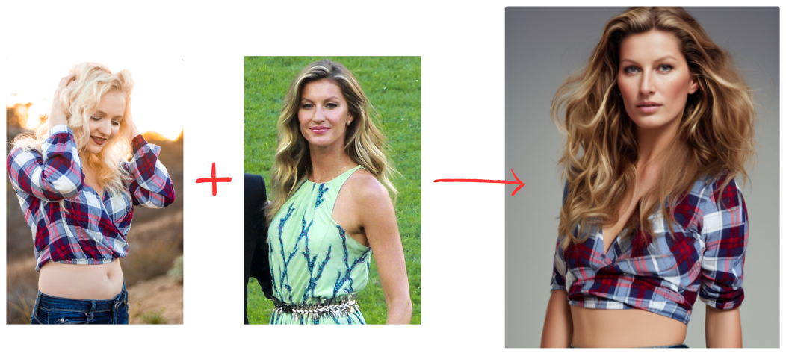


## Who Can Benefit from This Feature?


* **E-commerce companies** can superimpose clothing on models or mannequins to create advertisements. This capability allows them to efficiently scale their operations by handling a large volume of images without the logistical challenges of traditional photoshoots.
* **Shoppers **can quickly see how clothes would look on them by simulating the garments on their own images. This enhances the shopping experience, increases customer satisfaction, and can lead to higher sales.


# Steps to Virtual Garment Try-On with Astria

Developers interested in integrating Virtual Try-On capabilities into their applications can seamlessly utilize the APIs provided by [Astria](https://www.astria.ai).

Here’s what you need to do step-by-step.

First, create the fine-tune of a model.


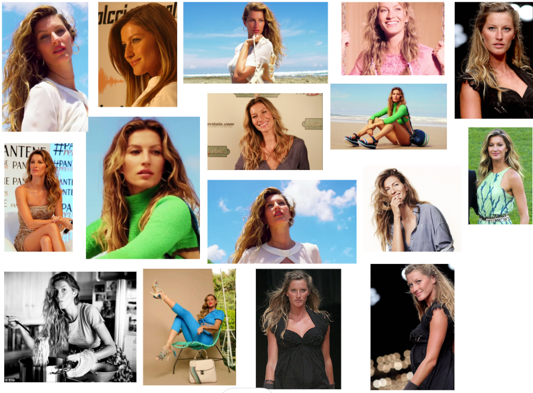


We’ve used around 16 publicly available images of supermodel Gisele Bundchen, and created a fine-tune out of it.

Go to Tunes → New Fine Tune, and create a Checkpoint tune from the above images.


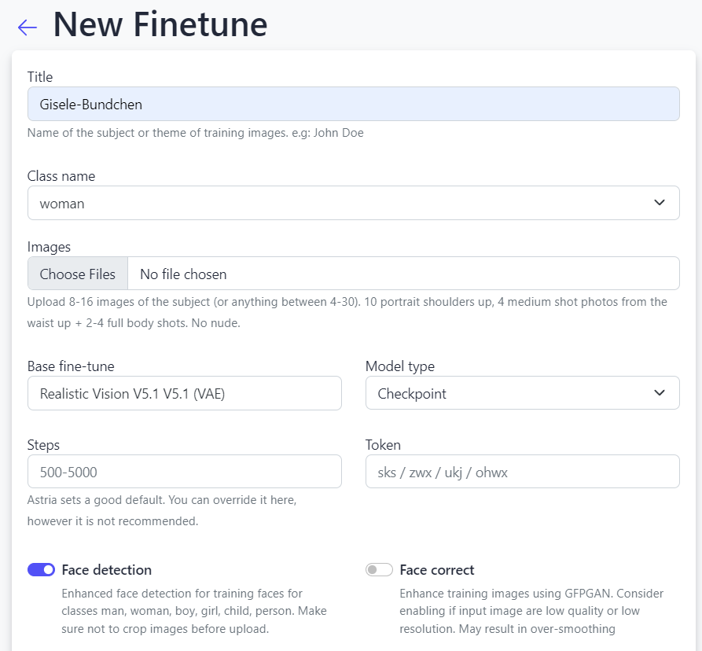


You can also do it via the API as follows:


```
curl -X POST -H "Authorization: Bearer $API_KEY" https://api.astria.ai/tunes \
         -F tune[title]="Gisele-Bundchen" \
         -F tune[name]=man \
         -F tune[branch]="fast" \
         -F tune[callback]="https://optional-callback-url.com/webhooks/astria?user_id=1&tune_id=1" \
         -F tune[base_tune_id]=690204 \
         -F tune[token]=ohwx \
         -F tune[prompts_attributes][0][callback]="https://optional-callback-url.com/webhooks/astria?user_id=1&prompt_id=1&tune_id=1" \
         -F tune[images][0]="@1.jpg" \
         -F tune[images][1]="@2.jpg" \
         -F tune[images][2]="@3.jpg" \
```


Next, create a FaceID fine-tune of the garment image. The image could be of a model wearing a garment, or it could be displayed on a mannequin, or it could simply be the garment laid out flatly. Let’s try the last approach.


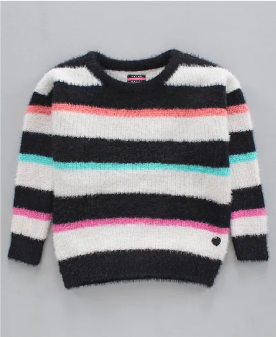


While generating the FaceID for the sweater, it’s important to mention the class name as either `clothing`, in case you have full body clothing like a dress or a swimsuit. If you want to just mask the upper body, for e.g. with shirts, t-shorts, tops, then use the class name `shirt`. Similarly to mask the lower body use the class name `pants`. This ensures that the tune preserves the appropriate part of the garment while generating the images.


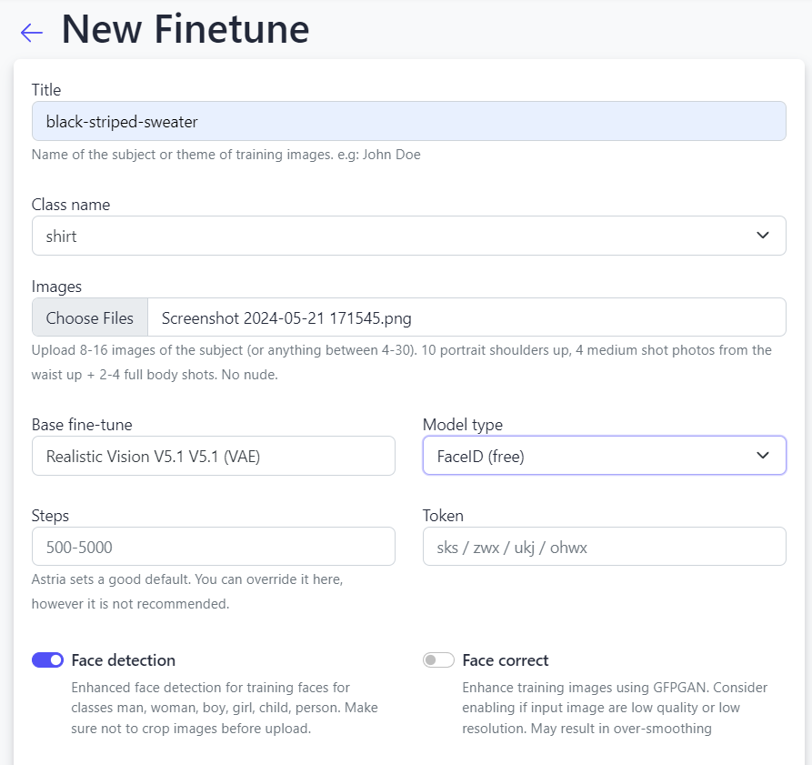


Let’s try a basic prompt. Get the tune id of your FaceID tune: `&lt;faceid:1328287:1.0>, `in our case.


Now let’s go back to the finetune of our model (Gisele Bundchen) in the Tunes section.


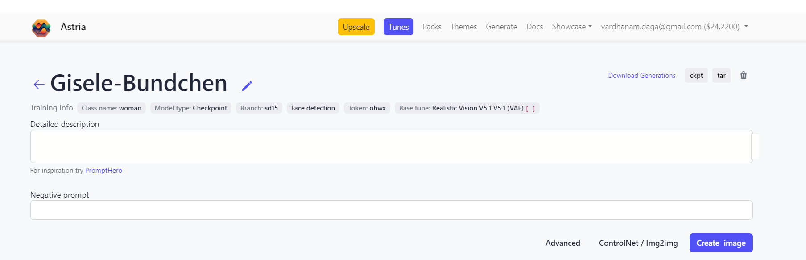


We’ll use the following prompt:


```
<faceid:1328287:1.0> Mid-shot of ohwx woman wearing a sweater
num_images=4
negative_prompt=
seed=
steps=
cfg_scale=
controlnet=
input_image_url=
mask_image_url=
denoising_strength=
controlnet_conditioning_scale=
controlnet_txt2img=false
super_resolution=true
inpaint_faces=true
face_correct=false
film_grain=false
face_swap=true
hires_fix=true
backend_version=1
ar=1:1
scheduler=euler_a
color_grading=
use_lpw=false
w=512
h=640
```


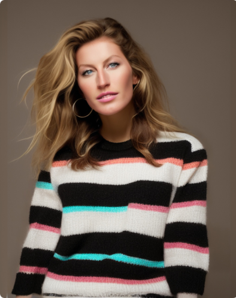


If we want more elements in the background, we can juice up the prompt in the following manner:


```
<faceid:1328287:1.0> A serene portrait of ohwx woman wearing a cozy sweater, standing amidst the lush green hills. The scene captures a tranquil afternoon with soft sunlight filtering through the clouds, highlighting her gentle smile and the vibrant colors of the landscape around her. The sweater is detailed, with visible textures of the knit fabric. The background features rolling hills and a clear blue sky, enhancing the peaceful ambiance.
num_images=4
negative_prompt=
seed=
steps=
cfg_scale=
controlnet=
input_image_url=
mask_image_url=
denoising_strength=
controlnet_conditioning_scale=
controlnet_txt2img=false
super_resolution=true
inpaint_faces=true
face_correct=false
film_grain=false
face_swap=true
hires_fix=true
backend_version=1
ar=1:1
scheduler=euler_a
color_grading=
use_lpw=false
w=512
h=640
```


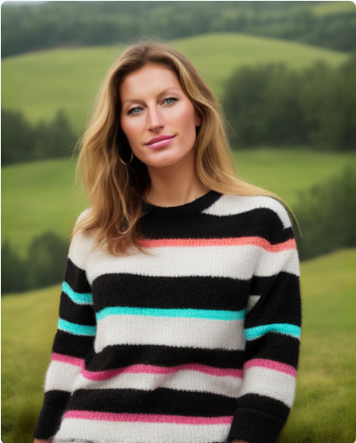


Next, let’s create a garment FaceID from the image of a person wearing it. Let’s take this as our input image:


Prompt:


```
<faceid:1328375:1.0> A professional studio portrait of a ohwx woman wearing a vibrant yellow top. The studio lighting is expertly arranged to cast dramatic yet flattering shadows and highlights, emphasizing the unique texture and style of the top. The model poses confidently, with a neutral background that enhances the striking color of her outfit. The image captures a high-fashion aesthetic, focusing on the elegant details of the clothing and the model's composed expression.
num_images=4
negative_prompt=
seed=
steps=
cfg_scale=
controlnet=
input_image_url=
mask_image_url=
denoising_strength=
controlnet_conditioning_scale=
controlnet_txt2img=false
super_resolution=true
inpaint_faces=true
face_correct=false
film_grain=false
face_swap=true
hires_fix=true
backend_version=1
ar=1:1
scheduler=euler_a
color_grading=
use_lpw=false
w=512
h=640
```


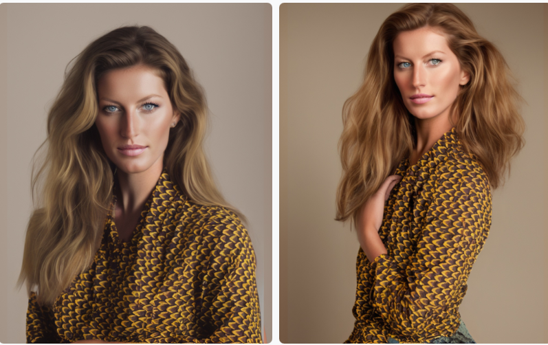


After this we’ll try out Virtual Try-On on with swimwear. Input image:


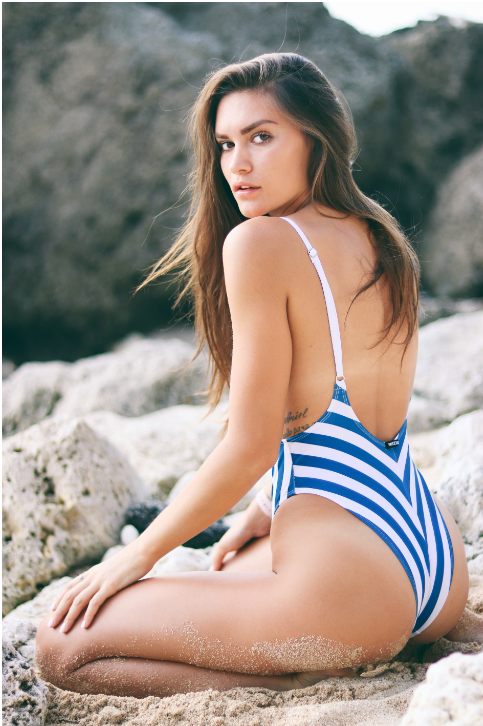


But this time, we also want to preserve the pose of the model in the input image. We can do so by enabling Img2Img while keeping the ControlNet Hint as ‘Pose’ for preserving the pose of our original model.

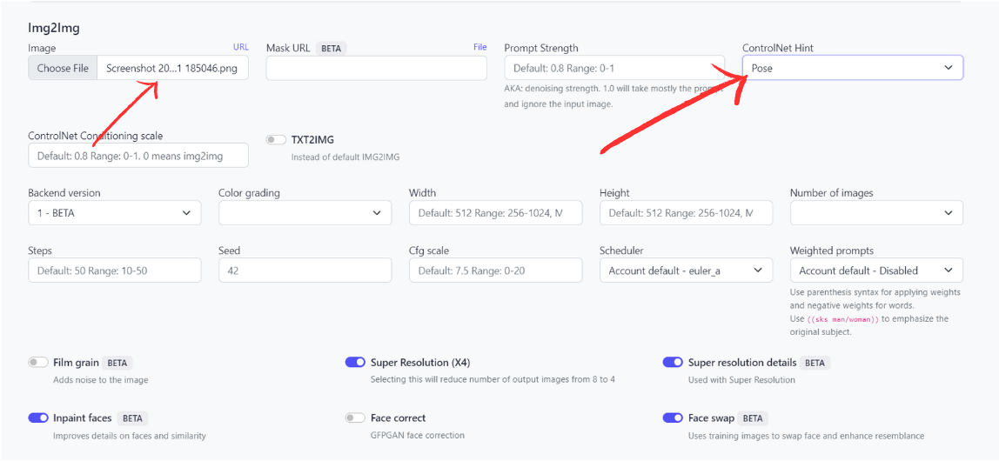


Prompt:


```
<faceid:1328399:1.0> ohwx woman wearing a swimsuit on a beach
num_images=4
negative_prompt=
seed=
steps=
cfg_scale=
controlnet=pose
input_image_url=https://sdbooth2-production.s3.amazonaws.com/60vrd6qqb5jjcx6aj62cgw9jo8v8
mask_image_url=
denoising_strength=
controlnet_conditioning_scale=
controlnet_txt2img=false
super_resolution=true
inpaint_faces=true
face_correct=false
film_grain=false
face_swap=true
hires_fix=true
backend_version=1
ar=1:1
scheduler=euler_a
color_grading=
use_lpw=false
w=
h=
```


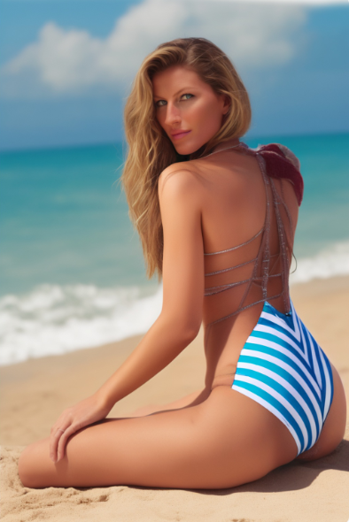


Last, but not the least, is our favorite - replicating Virtual Try-On on from a mannequin!

Here’s the input image:

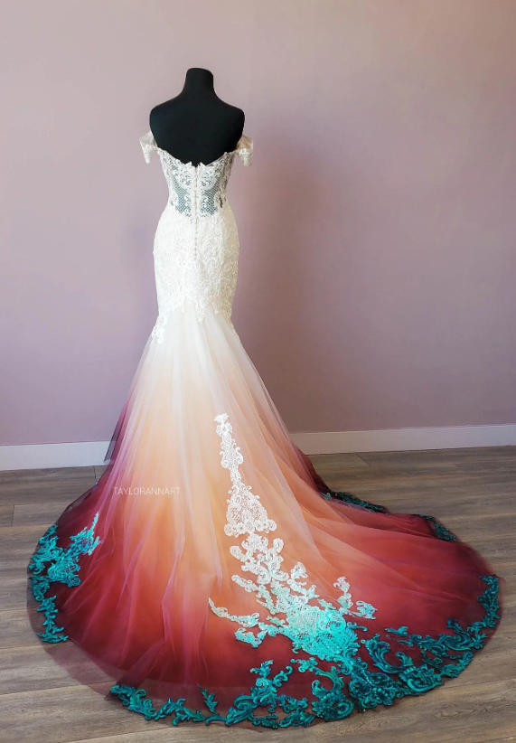


Prompt:


```
<faceid:1328568:1.0> An elegant ohwx woman model walking down the runway in a stunning designer gown. The ramp is lit by sophisticated overhead lighting that casts a dramatic glow, highlighting the silhouette and textures of the gown. The audience is blurred in the background, focusing all attention on the model's dynamic pose and the breathtaking attire. The atmosphere is vibrant and glamorous, capturing the essence of high fashion.
num_images=4
negative_prompt=
seed=
steps=
cfg_scale=
controlnet=
input_image_url=
mask_image_url=
denoising_strength=
controlnet_conditioning_scale=
controlnet_txt2img=false
super_resolution=true
inpaint_faces=true
face_correct=false
film_grain=false
face_swap=true
hires_fix=true
backend_version=1
ar=1:1
scheduler=euler_a
color_grading=
use_lpw=false
w=512
h=640
```

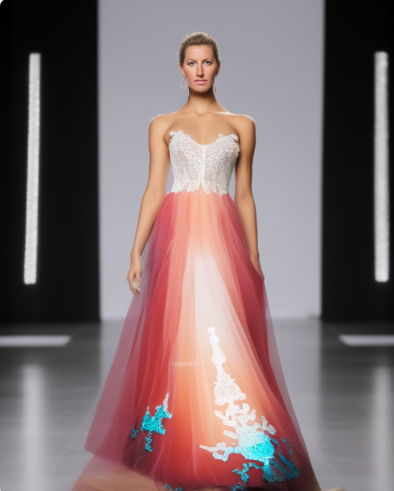


# Final Words

Using Virtual Try-On with Astria is seamless and the results are nearly perfect. With minimal effort, any business can visualize different outfits on models or on their customers. The clothes fit perfectly and blend in accurately with the model they are simulated on.
